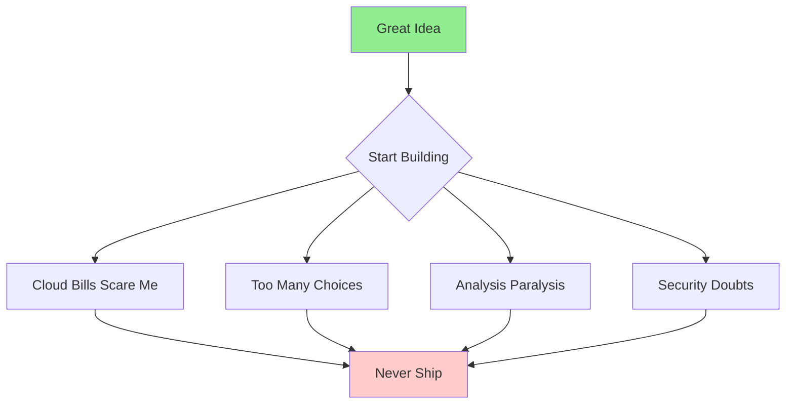

# The MVP Builder's Challenge

[← Back to Guide](README.md) | [Next: Key Concepts →](02-key-concepts.md)

---

## The Problem Every Builder Faces



**The Reality:**

- Cloud bills scare builders
- Too many architectural choices
- Analysis paralysis sets in
- Security implementation doubts
- **Result: Ideas never ship**

---

## The Solution: MVP-First Approach

Ship an MVP this weekend without surprise bills using modern stack with real users, all on AWS Free Tier.

### Why This Approach Works

**Traditional Approach (Fails):**

```
Perfect Architecture → Perfect Code → Perfect Features → Never Ship
```

**MVP Approach (Succeeds):**

```
Basic Architecture → Working Code → One Feature → Ship → Iterate
```

---

## Why This Matters

### Four Critical Reasons

#### 1. **Validate Ideas Fast** ⚡

- Test market demand quickly
- Get real user feedback
- Fail fast, pivot faster

#### 2. **Build Real, Not Slides** 🚀

- Working product beats perfect presentation
- Real users provide honest feedback
- Demonstrate actual capability

#### 3. **Grow Cloud Skills** 📈

- Hands-on AWS experience
- Modern development practices
- Industry-relevant portfolio

#### 4. **Control Costs Early** 💰

- Learn cost management from day one
- Avoid expensive surprises
- Scale economically

---

## The Weekend Promise

By following this guide, you will:

**By Saturday Evening:**

- ✅ Working authentication system
- ✅ Database storing real data
- ✅ One core feature implemented
- ✅ Deployed to production

**By Sunday Evening:**

- ✅ Polished user interface
- ✅ Real users testing your app
- ✅ Cost monitoring in place
- ✅ Foundation for scaling

**Total Cost:** $0-5 (within free tier limits)

---

## Success Stories

> _"I built my first SaaS in one weekend using this approach. It now has 500+ users and I still pay less than $20/month."_  
> — Former Workshop Attendee

> _"This guide helped me get my first cloud job. The hands-on experience was exactly what employers were looking for."_  
> — CS Student

---

## Ready to Start?

The next sections will give you:

- **Key concepts** you need to understand
- **Architecture patterns** that scale
- **Step-by-step implementation** guide
- **Cost control** strategies

Let's turn your idea into reality this weekend.

---

[← Back to Guide](README.md) | [Next: Key Concepts →](02-key-concepts.md)
