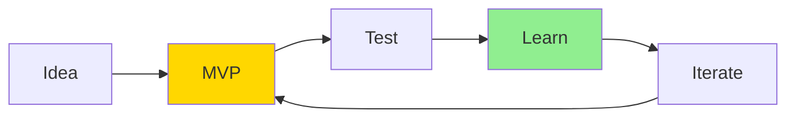
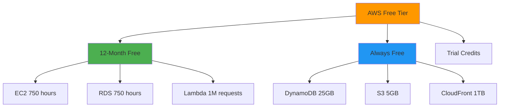
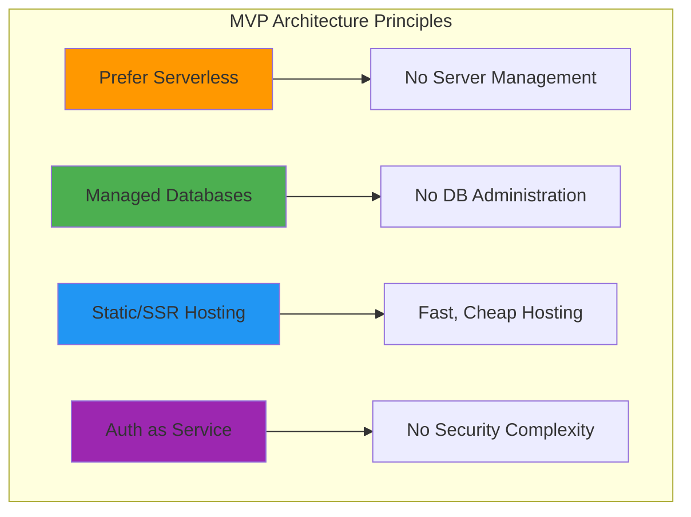
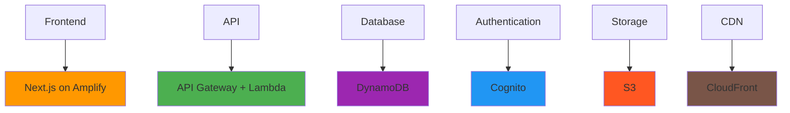

# Key Concepts for MVP Success

[← Back: The Challenge](01-the-challenge.md) | [Next: Case Study →](03-case-study.md)

---

## MVP: Minimum Viable Product



### MVP Principles

**What MVP Means:**

- **Minimum**: Smallest testable version
- **Viable**: Solves a real problem
- **Product**: Users can actually use it
- **Focus**: One job done well

**The MVP Mindset:**

- **Ship, Learn, Iterate** - not perfect, then ship
- **Real feedback > Perfect features**
- **Working software > Comprehensive documentation**
- **Customer collaboration > Contract negotiation**

### MVP vs. Complete Product

| MVP Approach     | Traditional Approach |
| ---------------- | -------------------- |
| 1 core feature   | 10+ features         |
| Basic UI         | Pixel-perfect design |
| Manual processes | Full automation      |
| Ship in days     | Ship in months       |
| Learn from users | Assume user needs    |

---

## AWS Free Tier: Your Startup's Best Friend



### Understanding Free Tier Categories

**12-Month Free (New AWS Accounts):**

- Available for first 12 months only
- Generous compute and database allowances
- Perfect for MVP development and testing

**Always Free:**

- Never expires
- Usage limits apply
- Great for production workloads within limits

**Trial Credits:**

- Service-specific free usage
- Time-limited offers
- Monitor expiration dates

### Key Free Tier Services for MVPs

| Service         | Free Tier Limit   | Perfect For   |
| --------------- | ----------------- | ------------- |
| **Lambda**      | 1M requests/month | API endpoints |
| **DynamoDB**    | 25GB storage      | User data     |
| **S3**          | 5GB storage       | File uploads  |
| **Cognito**     | 50K MAUs          | User auth     |
| **API Gateway** | 1M calls          | REST APIs     |
| **CloudFront**  | 1TB transfer      | Global CDN    |

---

## Architecture Choices for MVPs



### Smart Architectural Defaults

#### 1. **Prefer Serverless**

```typescript
// Good: Serverless approach
const mvpChoice = {
  compute: "AWS Lambda",
  benefits: ["Pay per request", "Auto-scaling", "No server management"],
};

// Avoid: Server management
const complexChoice = {
  compute: "EC2 + Load Balancer + Auto Scaling",
  problems: ["Always-on costs", "Server maintenance", "Complex scaling"],
};
```

#### 2. **Managed Databases**

```typescript
// Good: Managed database
const simple = {
  database: "DynamoDB",
  benefits: ["No administration", "Auto-scaling", "Built-in security"],
};

// Avoid: Self-managed database
const complex = {
  database: "PostgreSQL on EC2",
  problems: ["Backup management", "Security patches", "Performance tuning"],
};
```

#### 3. **Static/SSR Hosting**

```typescript
// Good: Modern hosting
const efficient = {
  hosting: "Amplify Hosting",
  benefits: ["CDN included", "Auto-deploy", "HTTPS by default"],
};

// Avoid: Custom server
const complicated = {
  hosting: "Custom Express server",
  problems: ["Server maintenance", "SSL certificates", "Scaling complexity"],
};
```

#### 4. **Authentication as a Service**

```typescript
// Good: Managed auth
const secure = {
  auth: "Amazon Cognito",
  benefits: ["Built-in security", "Social login", "User management UI"],
};

// Avoid: Custom auth
const risky = {
  auth: "Custom JWT implementation",
  problems: [
    "Security vulnerabilities",
    "Password reset flows",
    "Session management",
  ],
};
```

---

## The Serverless Advantage

### Why Serverless for MVPs?

**Cost Benefits:**

- Pay only for actual usage
- No idle server costs
- Automatic scaling up and down

**Development Benefits:**

- Focus on business logic
- No infrastructure management
- Faster time to market

**Operational Benefits:**

- Built-in monitoring
- Automatic backups
- Security patches handled

### Serverless Service Map



---

## Cost-First Thinking

### The MVP Budget Framework

**Tier 1: Free Tier Only ($0/month)**

- Perfect for initial development
- Support 100-1000 early users
- No payment method required

**Tier 2: Minimal Paid ($5-20/month)**

- Custom domain
- Additional storage
- Email services

**Tier 3: Growth Mode ($20-100/month)**

- Increased limits
- Advanced features
- Production monitoring

### Always Monitor These Costs

```bash
# Weekly cost check
aws ce get-cost-and-usage \
    --time-period Start=2024-01-01,End=2024-01-31 \
    --granularity MONTHLY \
    --metrics "BlendedCost"
```

**Set Alerts:**

- 80% of budget: Optimization time
- 100% of budget: Emergency review
- Unusual spikes: Investigate immediately

---

## Next: See It In Action

Now that you understand the core concepts, let's see how they come together in a real weekend project.

---

[← Back: The Challenge](01-the-challenge.md) | [Next: Case Study →](03-case-study.md)
