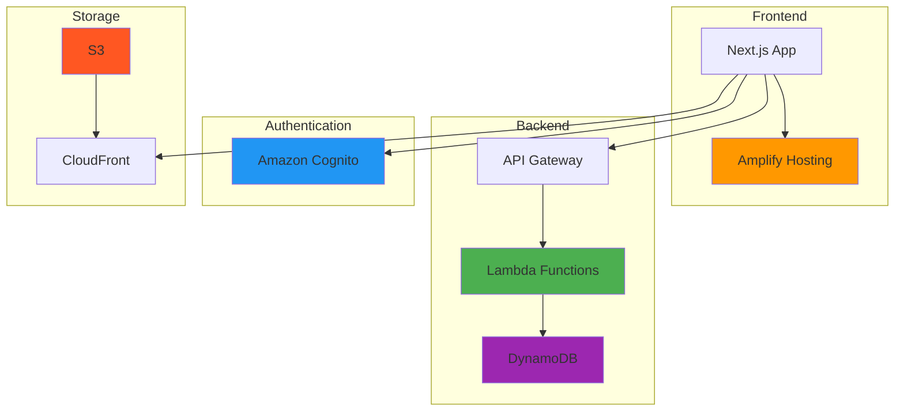
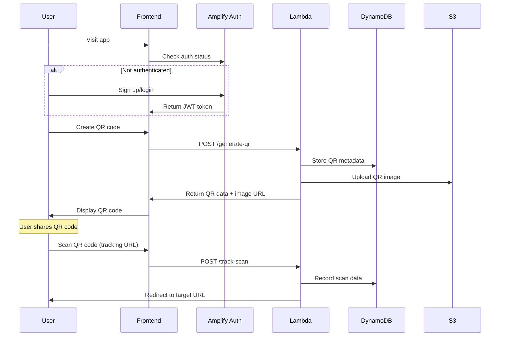

# Weekend MVP Case Study: QR Code Generator

[← Back: Key Concepts](02-key-concepts.md) | [Next: Demo Steps →](04-demo-steps.md)

---

## The Project: Simple SaaS in One Weekend

Let's build a **QR Code Generator** that demonstrates all MVP principles in action.

### Why This Project?

✅ **Solves a real problem**: Businesses need trackable QR codes  
✅ **Simple core feature**: Generate and track QR codes  
✅ **Demonstrates full stack**: Frontend, backend, database, auth  
✅ **Monetizable**: Clear path to paid features  
✅ **Free tier friendly**: Minimal resource usage

---

## MVP Feature Scope

### ✅ **Core Features (Weekend 1)**

- User registration/login
- Generate QR codes with custom URLs
- View QR code history
- Basic scan tracking
- Download QR images

### 🚫 **NOT in MVP (Future Versions)**

- ❌ Advanced analytics dashboard
- ❌ Team collaboration
- ❌ Custom QR designs
- ❌ Bulk QR generation
- ❌ API for developers

**Remember:** Ship the minimum that solves the problem!

---

## Architecture Overview



### Why This Stack?

**Frontend: Next.js on Amplify**

- Modern React framework with SSR
- Automatic deployments from Git
- CDN and HTTPS included
- **Cost**: Free for small projects

**API: API Gateway + Lambda**

- Serverless, pay-per-request
- Auto-scaling from 0 to millions
- Built-in monitoring
- **Cost**: 1M requests free/month

**Database: DynamoDB**

- NoSQL, perfect for user data
- Auto-scaling storage
- Built-in security
- **Cost**: 25GB free storage

**Auth: Amazon Cognito**

- Complete user management
- Social login support
- Built-in security features
- **Cost**: 50K users free

**Storage: S3 + CloudFront**

- Store QR code images
- Global CDN delivery
- Automatic optimization
- **Cost**: 5GB + 1TB transfer free

---

## Data Model Design

### Database Tables

```mermaid
erDiagram
    QrItems ||--o{ QrScans : tracks
    Users ||--o{ QrItems : owns

    Users {
        string id PK "Cognito User ID"
        string email "User email"
        datetime createdAt "Registration date"
    }

    QrItems {
        string id PK "ULID identifier"
        string targetUrl "Original URL"
        string s3Key "Image file path"
        string ownerSub "User ID"
        datetime createdAt "Creation date"
        int scanCount "Total scans"
        datetime lastScanAt "Last scan time"
    }

    QrScans {
        string qrId PK "QR Code ID"
        datetime scanAt SK "Scan timestamp"
        string userAgent "Browser info"
        string referer "Source page"
        string ipAddress "User IP"
    }
```

### Why This Design?

**Simple & Scalable:**

- Each table has a clear purpose
- Efficient queries with proper keys
- Easy to understand and maintain

**Privacy-Conscious:**

- Minimal user data collection
- IP addresses can be anonymized
- GDPR-friendly design

**Performance Optimized:**

- DynamoDB single-table patterns
- Global Secondary Indexes for queries
- Efficient data access patterns

---

## User Journey Flow



### Key User Flows

**1. New User Onboarding**

- Sign up with email
- Verify email address
- Create first QR code
- See it work immediately

**2. QR Code Creation**

- Enter target URL
- Generate QR code instantly
- Download or share image
- View in dashboard

**3. Analytics Review**

- View QR code list
- See scan counts
- Basic demographics
- Export data (future)

---

## Technical Implementation

### Frontend Structure

```
app/
├── (auth)/
│   ├── login/
│   └── signup/
├── dashboard/
│   ├── page.tsx          # QR list
│   └── create/
│       └── page.tsx      # QR creation form
├── qr/
│   └── [id]/
│       └── page.tsx      # Tracking & redirect
└── components/
    ├── QRGenerator.tsx
    ├── QRList.tsx
    └── Analytics.tsx
```

### Backend Functions

```
amplify/functions/
├── generateQr/
│   └── handler.ts        # Create QR + upload to S3
├── trackScan/
│   └── handler.ts        # Record scan + redirect
└── getAnalytics/
    └── handler.ts        # Fetch usage stats
```

### Environment Variables

```bash
# Client-side
NEXT_PUBLIC_BASE_URL=https://myapp.amplifyapp.com
NEXT_PUBLIC_APP_NAME="QR Code Generator"

# Server-side (Lambda)
BASE_URL=https://myapp.amplifyapp.com
AMPLIFY_STORAGE_BUCKET_NAME=auto-generated
```

---

## MVP Success Metrics

### Technical Metrics

- ✅ App loads in <2 seconds
- ✅ QR generation takes <5 seconds
- ✅ 99%+ uptime
- ✅ Mobile-responsive design

### Business Metrics

- 🎯 10 users in first week
- 🎯 50 QR codes generated
- 🎯 100 scans recorded
- 🎯 1 user provides feedback

### Cost Metrics

- 🎯 Stay within $5/month
- 🎯 Monitor daily spending
- 🎯 Track free tier usage
- 🎯 Optimize before scaling

---

## Post-MVP Roadmap

### Week 2-4: Polish

- Improve UI/UX based on feedback
- Add more QR customization options
- Implement bulk operations
- Add team sharing features

### Month 2: Monetization

- Implement usage limits for free tier
- Add premium features
- Introduce monthly subscriptions
- Create API access plans

### Month 3+: Scale

- Advanced analytics dashboard
- White-label solutions
- Enterprise features
- Mobile app

---

## Ready to Build?

This case study shows how a simple idea becomes a real product using AWS services. The next section walks through the exact steps to build this over a weekend.

**Remember the MVP mindset:**

- Start simple
- Ship early
- Learn from users
- Iterate quickly

---

[← Back: Key Concepts](02-key-concepts.md) | [Next: Demo Steps →](04-demo-steps.md)
