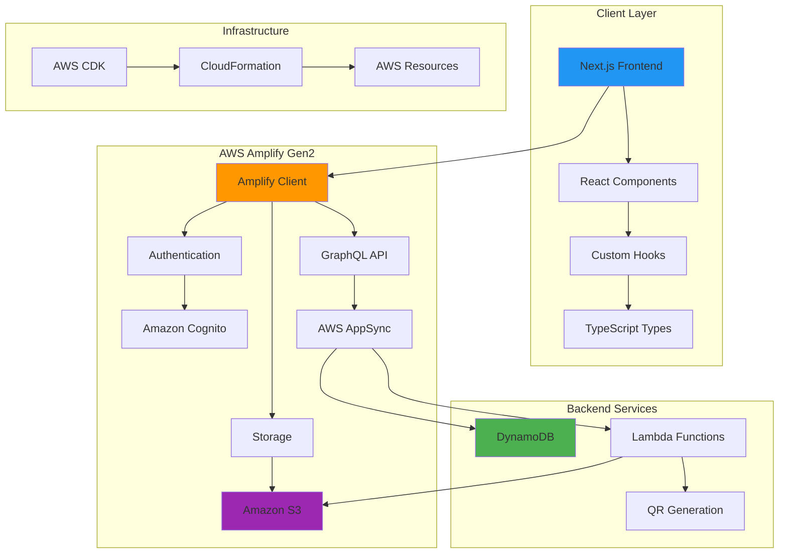
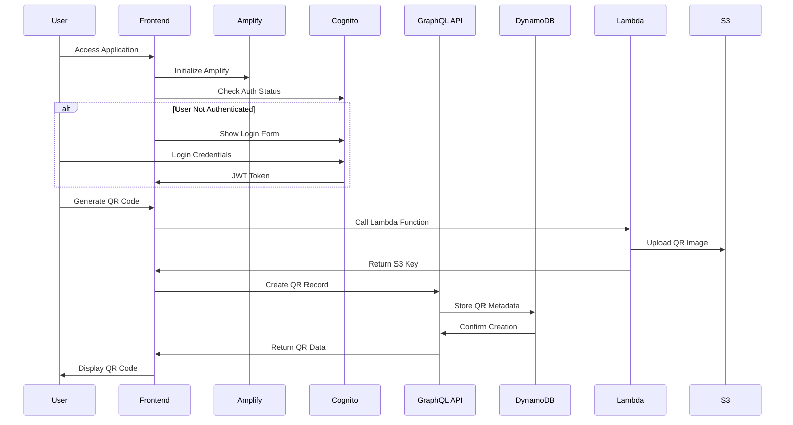
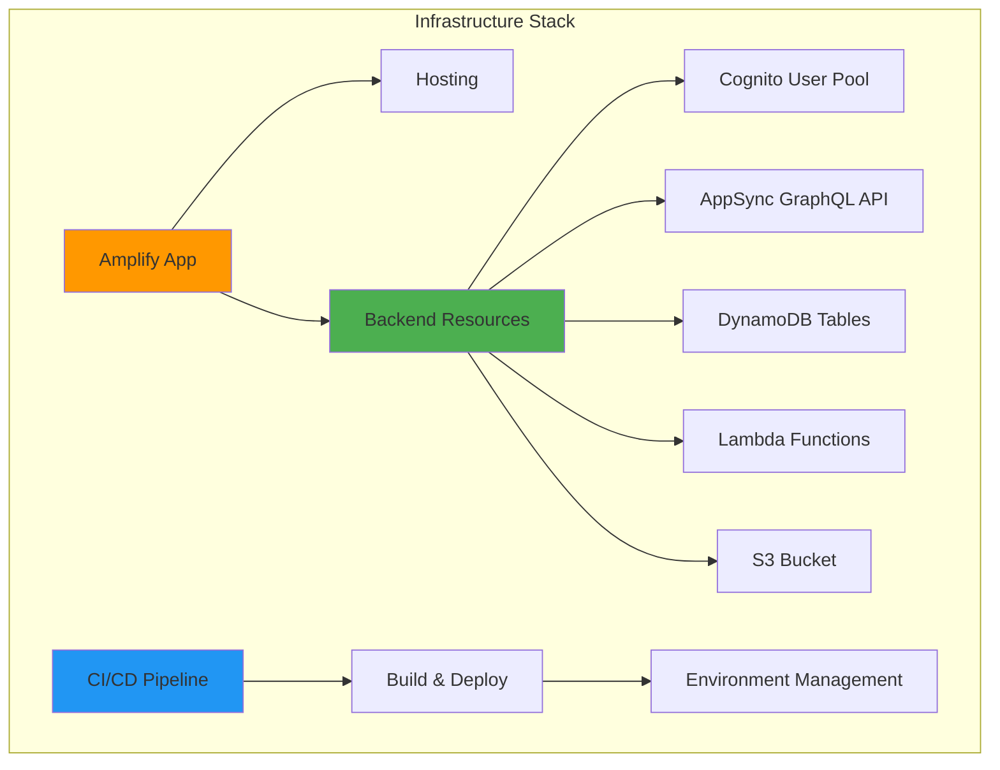
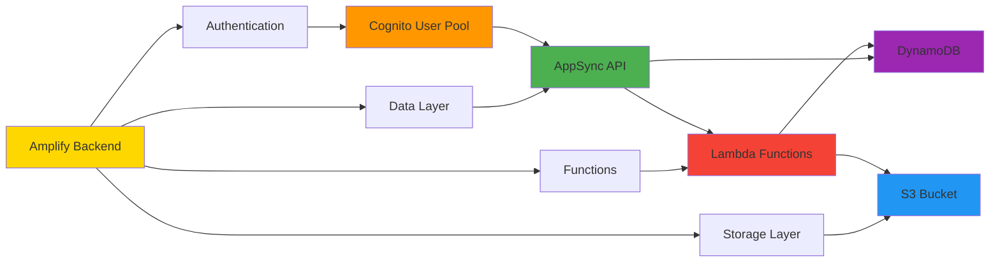
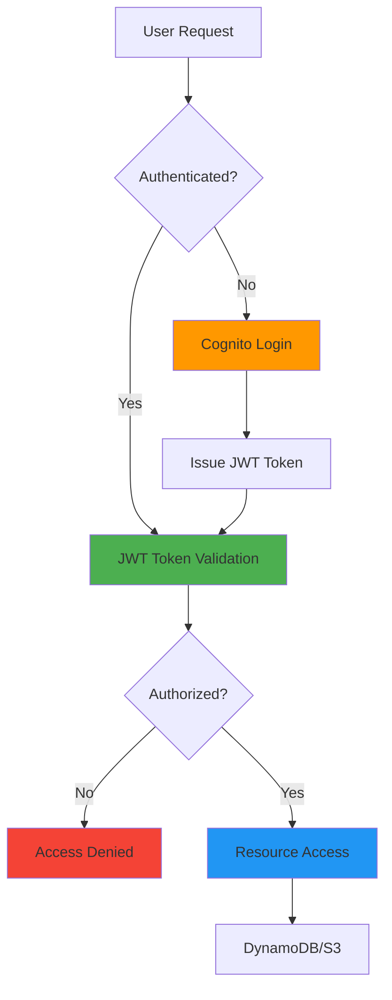
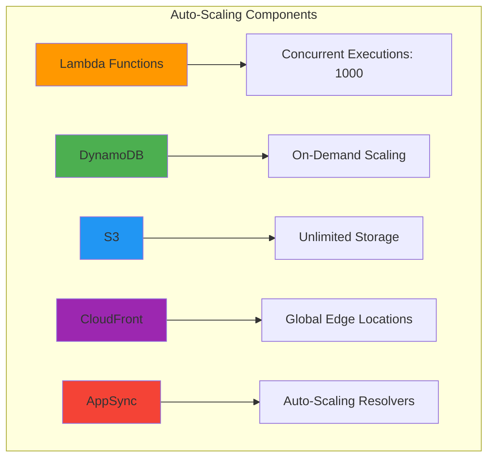
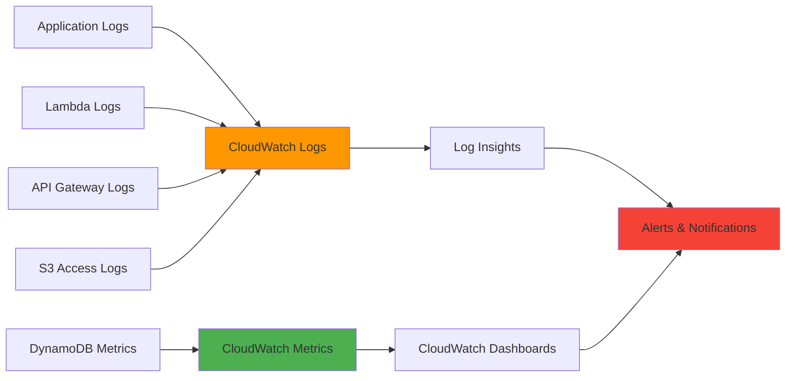
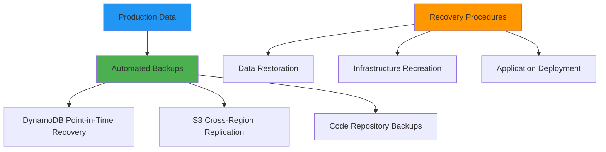

# Architecture Overview

## System Architecture



## Data Flow Architecture

### User Authentication Flow



## Component Architecture

### Frontend Components Structure

```
├── app/
│   ├── components/
│   │   ├── auth/
│   │   │   ├── AuthProvider.tsx
│   │   │   ├── LoginForm.tsx
│   │   │   └── SignUpForm.tsx
│   │   ├── qr/
│   │   │   ├── QRGenerator.tsx
│   │   │   ├── QRList.tsx
│   │   │   └── QRCard.tsx
│   │   ├── ui/
│   │   │   ├── Button.tsx
│   │   │   ├── Input.tsx
│   │   │   └── LoadingSpinner.tsx
│   │   └── layout/
│   │       ├── Header.tsx
│   │       ├── Navigation.tsx
│   │       └── Footer.tsx
│   ├── hooks/
│   │   ├── useAuth.ts
│   │   ├── useQRCodes.ts
│   │   └── useStorage.ts
│   ├── utils/
│   │   ├── validation.ts
│   │   ├── formatting.ts
│   │   └── constants.ts
│   └── types/
│       ├── auth.ts
│       ├── qr.ts
│       └── common.ts
```

### Backend Services Structure

```
├── amplify/
│   ├── auth/
│   │   └── resource.ts
│   ├── data/
│   │   └── resource.ts
│   ├── storage/
│   │   └── resource.ts
│   ├── functions/
│   │   ├── qrGenerateFn/
│   │   │   ├── handler.ts
│   │   │   └── resource.ts
│   │   └── qrTrackFn/
│   │       ├── handler.ts
│   │       └── resource.ts
│   └── backend.ts
```

## Infrastructure as Code

### AWS CDK Stack Overview



### Resource Dependencies



## Security Architecture

### Authentication & Authorization



### Data Protection Layers

1. **Network Security**
   - HTTPS/TLS encryption in transit
   - VPC endpoints for private communication
   - CloudFront distribution with security headers

2. **Application Security**
   - JWT token-based authentication
   - Resource-level authorization rules
   - Input validation and sanitization

3. **Data Security**
   - Encryption at rest (DynamoDB, S3)
   - IAM roles and policies
   - Least privilege access principles

## Scalability Design

### Horizontal Scaling



### Performance Optimization

1. **Frontend Optimization**
   - Static site generation with Next.js
   - Image optimization and lazy loading
   - Code splitting and bundle optimization
   - CDN distribution via CloudFront

2. **Backend Optimization**
   - Lambda cold start minimization
   - DynamoDB query optimization
   - S3 object lifecycle management
   - AppSync response caching

## Monitoring & Observability

### Logging Architecture



### Key Metrics to Monitor

1. **Application Metrics**
   - User authentication success rate
   - QR code generation latency
   - File upload success rate
   - API response times

2. **Infrastructure Metrics**
   - Lambda invocation count and duration
   - DynamoDB read/write capacity usage
   - S3 request count and error rate
   - CloudFront cache hit ratio

3. **Business Metrics**
   - Daily active users
   - QR codes created per user
   - Feature adoption rates
   - User retention metrics

## Disaster Recovery

### Backup Strategy



### Multi-Region Considerations

1. **Current Single Region Setup**
   - All resources in primary region (us-east-1)
   - Cost-optimized for MVP stage
   - Manual failover procedures documented

2. **Future Multi-Region Options**
   - DynamoDB Global Tables for data replication
   - S3 Cross-Region Replication for assets
   - CloudFront global distribution
   - Route 53 health checks for automatic failover
