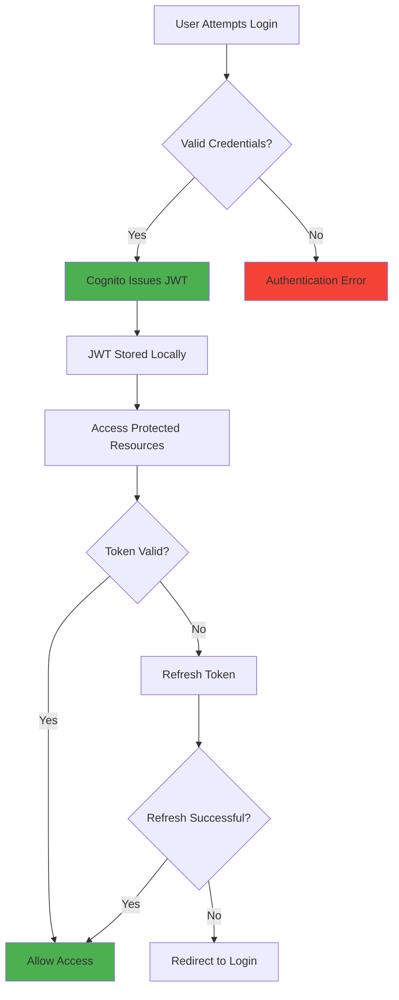
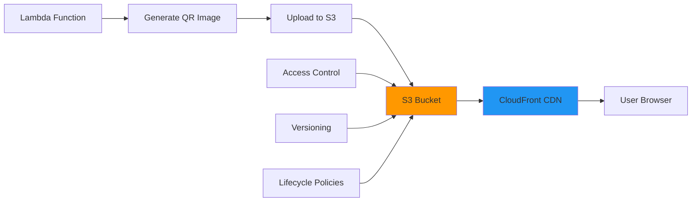
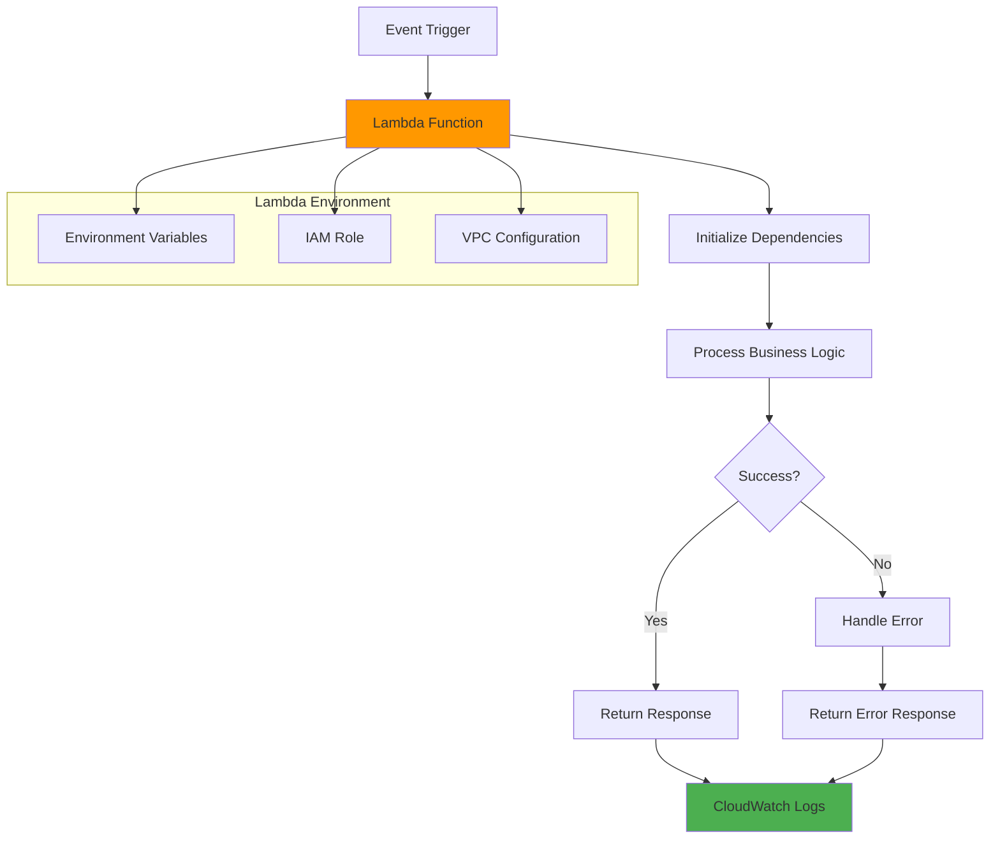
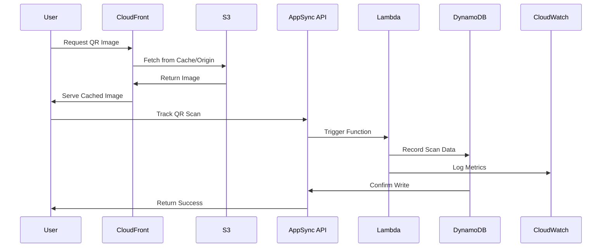
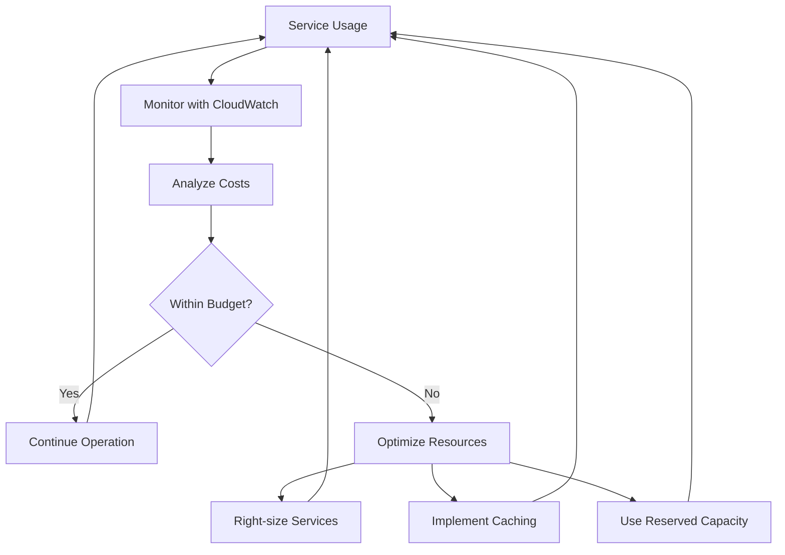

# Core AWS Services

## 1. AWS Amplify Gen2

### What is it?

AWS Amplify Gen2 is a next-generation full-stack development platform that provides:

- TypeScript-first development experience
- Git-based infrastructure management
- Integrated CI/CD pipelines
- Zero-configuration deployments

### Key Features

- **Code-first approach**: Define backend resources using TypeScript
- **Type safety**: End-to-end type safety from backend to frontend
- **Developer experience**: Hot reloading, local development, and debugging tools
- **Scalability**: Automatic scaling and managed infrastructure

### When to Use

- Full-stack web applications
- Mobile applications with backend requirements
- Rapid prototyping and MVP development
- Applications requiring real-time features

### Implementation Example

```typescript
// amplify/backend.ts
import { defineBackend } from "@aws-amplify/backend";
import { auth } from "./auth/resource.js";
import { data } from "./data/resource.js";
import { storage } from "./storage/resource.js";

const backend = defineBackend({
  auth,
  data,
  storage,
});

export default backend;
```

### Free Tier Benefits

- **Hosting**: 1,000 build minutes per month
- **Storage**: 5GB for app storage
- **Bandwidth**: 15GB served per month
- **Functions**: Included Lambda execution time

---

## 2. Amazon Cognito

### What is it?

Amazon Cognito provides user identity and access management for web and mobile applications.

### Components

#### User Pools

- User directory service with authentication and authorization
- Built-in sign-up and sign-in workflows
- Multi-factor authentication (MFA)
- Password policies and account recovery

#### Identity Pools

- AWS credential provider for authenticated and unauthenticated users
- Social identity federation (Google, Facebook, Amazon)
- Developer authenticated identities
- Guest user access

#### Hosted UI

- Pre-built authentication UI components
- Customizable branding and styling
- OAuth 2.0 and SAML integration
- Social provider integration

### Authentication Flow



### Implementation Example

```typescript
// amplify/auth/resource.ts
import { defineAuth } from "@aws-amplify/backend";

export const auth = defineAuth({
  loginWith: {
    email: true,
  },
  userAttributes: {
    email: {
      mutable: true,
      required: true,
    },
    name: {
      mutable: true,
      required: false,
    },
  },
  passwordPolicy: {
    minLength: 8,
    requireLowercase: true,
    requireNumbers: true,
    requireSymbols: true,
    requireUppercase: true,
  },
});
```

### Frontend Integration

```tsx
// components/auth/AuthProvider.tsx
"use client";

import { Authenticator } from "@aws-amplify/ui-react";
import "@aws-amplify/ui-react/styles.css";

export default function AuthProvider({
  children,
}: {
  children: React.ReactNode;
}) {
  return <Authenticator>{children}</Authenticator>;
}
```

### Free Tier Limits

- **MAU (Monthly Active Users)**: 50,000 free
- **MFA SMS messages**: Pay per message after free tier
- **Advanced security features**: Additional cost for risk-based authentication

---

## 3. Amazon DynamoDB

### What is it?

DynamoDB is a fully managed NoSQL database service designed for high-performance applications at any scale.

### Key Concepts

#### Tables and Items

- **Tables**: Collections of items (similar to rows in SQL)
- **Items**: Individual records with attributes
- **Attributes**: Key-value pairs that make up items

#### Primary Keys

- **Partition Key**: Unique identifier for each item
- **Sort Key**: Optional secondary identifier for ordering
- **Composite Key**: Combination of partition key and sort key

#### Secondary Indexes

- **Global Secondary Index (GSI)**: Alternative access patterns
- **Local Secondary Index (LSI)**: Alternative sort orders

### Data Model Design

```mermaid
erDiagram
    QrItems ||--o{ QrScans : tracks

    QrItems {
        string id PK "Primary Key (ULID)"
        string targetUrl "Original URL"
        string s3Key "S3 object key"
        string ownerSub "User ID from Cognito"
        datetime createdAt "Creation timestamp"
        datetime lastScanAt "Last scan timestamp"
        int scanCount "Total scan count"
    }

    QrScans {
        string qrId PK "QR Code ID"
        datetime scanAt SK "Scan timestamp"
        string ua "User Agent"
        string referer "HTTP Referer"
        string ip "IP Address"
        string country "Country Code"
    }
```

### Schema Definition

```typescript
// amplify/data/resource.ts
import { type ClientSchema, a, defineData } from "@aws-amplify/backend";

const schema = a.schema({
  QrItems: a
    .model({
      id: a.id().required(),
      targetUrl: a.string().required(),
      s3Key: a.string().required(),
      ownerSub: a.string(),
      createdAt: a.datetime().required(),
      lastScanAt: a.datetime(),
      scanCount: a.integer().default(0),
    })
    .authorization((allow) => [allow.publicApiKey(), allow.owner()])
    .secondaryIndexes((index) => [index("targetUrl").name("byTargetUrl")]),

  QrScans: a
    .model({
      qrId: a.string().required(),
      scanAt: a.datetime().required(),
      ua: a.string(),
      referer: a.string(),
      ip: a.string(),
      country: a.string(),
    })
    .authorization((allow) => [allow.publicApiKey()])
    .secondaryIndexes((index) => [
      index("qrId").sortKeys(["scanAt"]).name("byQrId"),
    ]),
});

export type Schema = ClientSchema<typeof schema>;
export const data = defineData({
  schema,
  authorizationModes: {
    defaultAuthorizationMode: "userPool",
  },
});
```

### Best Practices

#### Query Patterns

- Design tables around access patterns
- Use sparse indexes for optional attributes
- Batch operations for multiple items
- Implement pagination for large result sets

#### Performance Optimization

- Use DynamoDB Streams for real-time processing
- Enable point-in-time recovery for data protection
- Monitor and adjust read/write capacity
- Use eventually consistent reads when possible

### Free Tier Limits

- **Storage**: 25GB of storage
- **Read Capacity**: 25 RCUs (Read Capacity Units)
- **Write Capacity**: 25 WCUs (Write Capacity Units)
- **Global Tables**: 2 replicas included

---

## 4. Amazon S3 (Simple Storage Service)

### What is it?

Amazon S3 is an object storage service offering industry-leading scalability, data availability, security, and performance.

### Use Cases in Our Application

- Store generated QR code images
- Serve static assets and media files
- Backup and archive data
- Content distribution with CloudFront

### Storage Architecture



### Configuration Example

```typescript
// amplify/storage/resource.ts
import { defineStorage } from "@aws-amplify/backend";

export const storage = defineStorage({
  name: "qrCodeStorage",
  access: (allow) => ({
    "qr-images/*": [
      allow.authenticated.to(["read", "write"]),
      allow.guest.to(["read"]),
    ],
  }),
});
```

### Storage Classes

#### Standard Storage Classes

- **S3 Standard**: Frequently accessed data
- **S3 Standard-IA**: Infrequently accessed data
- **S3 One Zone-IA**: Infrequently accessed, single AZ

#### Archive Storage Classes

- **S3 Glacier Instant Retrieval**: Archive with instant access
- **S3 Glacier Flexible Retrieval**: Archive with retrieval times
- **S3 Glacier Deep Archive**: Lowest cost archive storage

### Security Features

#### Access Control

- **Bucket Policies**: Resource-based permissions
- **IAM Policies**: User and role-based permissions
- **Access Control Lists (ACLs)**: Object-level permissions
- **Presigned URLs**: Temporary access to objects

#### Encryption

- **Server-Side Encryption**: S3-managed or customer-managed keys
- **Client-Side Encryption**: Encrypt data before upload
- **Encryption in Transit**: HTTPS/TLS for data transfer

### Free Tier Limits

- **Storage**: 5GB of standard storage
- **Requests**: 20,000 GET requests, 2,000 PUT requests
- **Data Transfer**: 15GB transfer out per month

---

## 5. AWS Lambda

### What is it?

AWS Lambda is a serverless compute service that runs code in response to events and automatically manages the compute resources.

### Benefits

- **No server management**: Focus on code, not infrastructure
- **Automatic scaling**: Scales from zero to thousands of concurrent executions
- **Pay per use**: Only pay for compute time consumed
- **Built-in monitoring**: CloudWatch integration for logs and metrics

### Lambda Function Structure



### Implementation Example

```typescript
// amplify/functions/qrGenerateFn/handler.ts
import { APIGatewayProxyEvent, APIGatewayProxyResult } from "aws-lambda";
import QRCode from "qrcode";
import { S3Client, PutObjectCommand } from "@aws-sdk/client-s3";

const s3Client = new S3Client({ region: process.env.AWS_REGION });

export const handler = async (
  event: APIGatewayProxyEvent,
): Promise<APIGatewayProxyResult> => {
  try {
    const { targetUrl, qrId } = JSON.parse(event.body || "{}");

    // Generate QR code tracking URL
    const baseUrl = process.env.BASE_URL;
    const trackingUrl = `${baseUrl}/qr/${qrId}`;

    // Generate QR code image
    const qrBuffer = await QRCode.toBuffer(trackingUrl, {
      type: "png",
      width: 512,
      margin: 2,
    });

    // Upload to S3
    const s3Key = `qr-images/${qrId}.png`;
    const uploadCommand = new PutObjectCommand({
      Bucket: process.env.AMPLIFY_STORAGE_BUCKET_NAME,
      Key: s3Key,
      Body: qrBuffer,
      ContentType: "image/png",
      CacheControl: "public, max-age=31536000",
    });

    await s3Client.send(uploadCommand);

    return {
      statusCode: 200,
      body: JSON.stringify({
        s3Key,
        trackingUrl,
      }),
    };
  } catch (error) {
    console.error("Error generating QR code:", error);
    return {
      statusCode: 500,
      body: JSON.stringify({ error: "Failed to generate QR code" }),
    };
  }
};
```

### Function Configuration

```typescript
// amplify/functions/qrGenerateFn/resource.ts
import { defineFunction } from "@aws-amplify/backend";

export const qrGenerateFn = defineFunction({
  name: "qr-generate",
  entry: "./handler.ts",
  environment: {
    BASE_URL: process.env.BASE_URL || "http://localhost:3000",
  },
  runtime: 20, // Node.js runtime version
  timeoutSeconds: 30,
  memoryMB: 512,
});
```

### Performance Optimization

#### Cold Start Minimization

- Keep functions lightweight
- Minimize dependencies
- Use provisioned concurrency for critical functions
- Implement connection pooling for databases

#### Memory and Timeout Configuration

- Right-size memory allocation based on workload
- Set appropriate timeout values
- Monitor execution metrics and adjust as needed

### Free Tier Limits

- **Requests**: 1 million requests per month
- **Compute Time**: 400,000 GB-seconds per month
- **Storage**: No additional charge for code storage

---

## 6. AWS AppSync

### What is it?

AWS AppSync is a managed GraphQL service that enables real-time data synchronization and offline programming features.

### Key Features

- **Real-time subscriptions**: Live data updates
- **Offline synchronization**: Local data caching and sync
- **Multiple data sources**: DynamoDB, Lambda, HTTP APIs
- **Built-in security**: Authentication and authorization
- **Caching**: Automatic response caching

### GraphQL Schema Example

```graphql
type QrItem @model @auth(rules: [{ allow: owner }]) {
  id: ID!
  targetUrl: String!
  s3Key: String!
  ownerSub: String
  createdAt: AWSDateTime!
  lastScanAt: AWSDateTime
  scanCount: Int
  scans: [QrScan] @hasMany
}

type QrScan @model @auth(rules: [{ allow: public }]) {
  id: ID!
  qrId: String!
  scanAt: AWSDateTime!
  userAgent: String
  referer: String
  ipAddress: String
  country: String
  qrItem: QrItem @belongsTo
}
```

### Frontend Integration

```typescript
// hooks/useQRCodes.ts
import { useState, useEffect } from "react";
import { generateClient } from "aws-amplify/data";
import type { Schema } from "../../amplify/data/resource";

const client = generateClient<Schema>();

export function useQRCodes() {
  const [qrCodes, setQrCodes] = useState<Schema["QrItems"]["type"][]>([]);
  const [loading, setLoading] = useState(true);

  useEffect(() => {
    fetchQRCodes();

    // Subscribe to real-time updates
    const subscription = client.models.QrItems.onCreate().subscribe({
      next: ({ data }) => {
        setQrCodes((prev) => [...prev, data]);
      },
    });

    return () => subscription.unsubscribe();
  }, []);

  const fetchQRCodes = async () => {
    try {
      const { data } = await client.models.QrItems.list();
      setQrCodes(data);
    } catch (error) {
      console.error("Error fetching QR codes:", error);
    } finally {
      setLoading(false);
    }
  };

  const createQRCode = async (targetUrl: string) => {
    try {
      const { data } = await client.models.QrItems.create({
        targetUrl,
        createdAt: new Date().toISOString(),
        scanCount: 0,
      });
      return data;
    } catch (error) {
      console.error("Error creating QR code:", error);
      throw error;
    }
  };

  return {
    qrCodes,
    loading,
    createQRCode,
    refetch: fetchQRCodes,
  };
}
```

---

## 7. Amazon CloudFront

### What is it?

Amazon CloudFront is a content delivery network (CDN) service that securely delivers data, videos, applications, and APIs to customers globally with low latency and high transfer speeds.

### Benefits for Our Application

- **Global Distribution**: Edge locations worldwide
- **Performance**: Reduced latency for static assets
- **Security**: DDoS protection and SSL/TLS termination
- **Cost Optimization**: Reduced origin server load

### Configuration Example

```typescript
// CloudFront distribution configuration
const distribution = {
  origins: [
    {
      domainName: "s3-bucket.s3.amazonaws.com",
      originPath: "/static",
      customOriginConfig: {
        HTTPPort: 80,
        HTTPSPort: 443,
        originProtocolPolicy: "https-only",
      },
    },
  ],
  defaultCacheBehavior: {
    targetOriginId: "S3-static-assets",
    viewerProtocolPolicy: "redirect-to-https",
    compress: true,
    cachePolicyId: "managed-caching-optimized",
  },
  priceClass: "PriceClass_100", // Use only North America and Europe
};
```

### Free Tier Limits

- **Data Transfer**: 1TB out to internet per month
- **HTTP/HTTPS Requests**: 10 million per month
- **SSL Certificates**: Free SSL/TLS certificates via AWS Certificate Manager

---

## Service Integration Patterns

### Event-Driven Architecture



### Security Integration

All services work together to provide comprehensive security:

1. **Cognito** provides user authentication and JWT tokens
2. **AppSync** validates JWT tokens and applies authorization rules
3. **Lambda** functions inherit IAM roles for secure service access
4. **S3** uses bucket policies and IAM for access control
5. **CloudFront** provides DDoS protection and SSL termination

### Cost Optimization Strategy



This integrated approach ensures that all AWS services work together efficiently while maintaining cost control and optimal performance for your MVP application.
