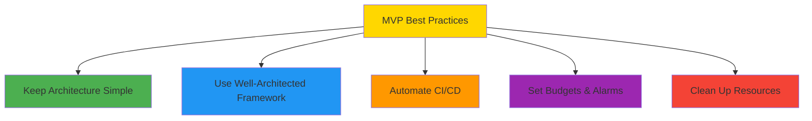
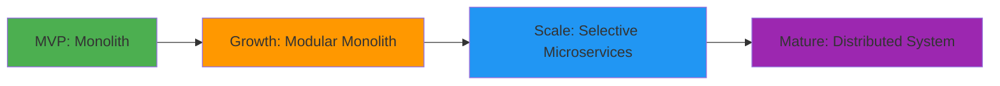
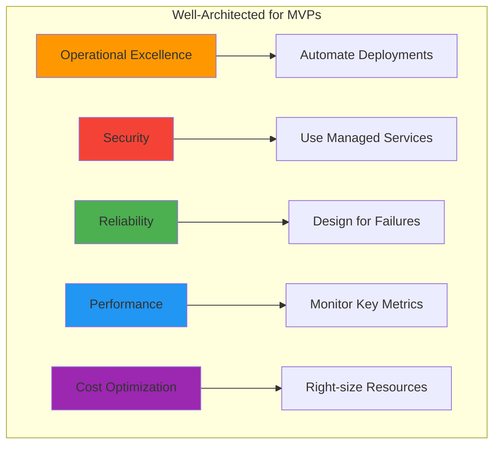
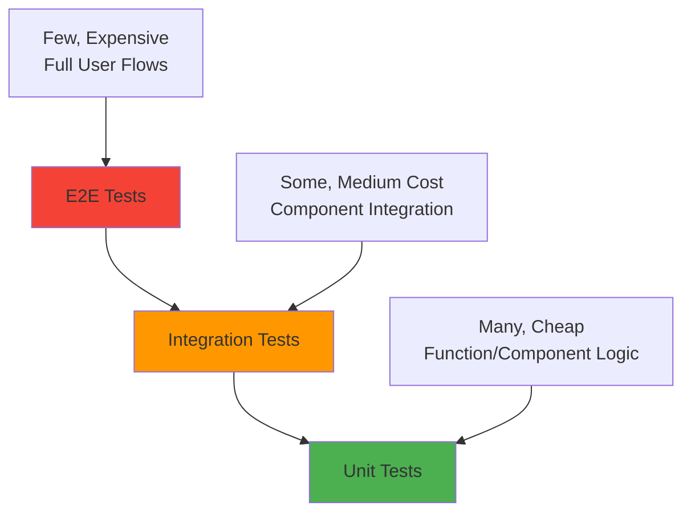

# Best Practices for MVP Builders

## The Five Pillars for MVP Success



---

## 1. Keep Architecture Simple

### Start Simple, Scale Smart

```typescript
// Good: Simple, serverless architecture
const mvpStack = {
  frontend: "Next.js on Amplify",
  api: "API Gateway + Lambda",
  database: "DynamoDB",
  auth: "Cognito",
  storage: "S3",
};

// Avoid: Complex microservices from day 1
const overEngineered = {
  frontend: "React + Docker + K8s",
  api: "Multiple microservices",
  database: "PostgreSQL cluster",
  auth: "Custom JWT implementation",
  storage: "Multiple storage solutions",
};
```

### Why Simple Wins

- **Faster to build and debug**: Less moving parts mean fewer potential failure points
- **Lower operational overhead**: Managed services reduce maintenance burden
- **Easier to understand and maintain**: Team members can quickly onboard
- **More time for features, less for infrastructure**: Focus on business logic

### Architecture Evolution Strategy



**Evolution Guidelines:**

- Start with a monolith or simple serverless architecture
- Extract services only when team size or complexity demands it
- Use feature flags to test new architectures gradually
- Measure performance impact of architectural changes

---

## 2. Use AWS Well-Architected Framework

### The Five Pillars Applied to MVPs



### Operational Excellence

**Principle**: Prepare, operate, and evolve

**MVP Implementation:**

```typescript
// Infrastructure as Code
const backendConfig = {
  // Version controlled infrastructure
  infrastructure: "AWS CDK via Amplify",

  // Automated deployments
  cicd: {
    trigger: "git push",
    environments: ["dev", "staging", "prod"],
    rollback: "automatic on failure",
  },

  // Observability
  monitoring: {
    logs: "CloudWatch Logs",
    metrics: "CloudWatch Metrics",
    alerts: "SNS notifications",
  },
};
```

**Key Practices:**

- Use Infrastructure as Code (Amplify backend definitions)
- Implement comprehensive logging and monitoring
- Automate deployments and rollbacks
- Document runbooks for common issues

### Security

**Principle**: Protect information and systems

**MVP Implementation:**

```typescript
// Security best practices
const securityConfig = {
  // Authentication
  auth: {
    provider: "Amazon Cognito",
    mfa: true,
    passwordPolicy: "strong",
  },

  // Authorization
  authorization: {
    model: "least privilege",
    roleBase: true,
    resourceLevel: true,
  },

  // Data protection
  encryption: {
    inTransit: "TLS 1.3",
    atRest: "AWS managed keys",
  },
};
```

**Key Practices:**

- Use managed authentication services (Cognito)
- Implement least privilege access
- Encrypt data in transit and at rest
- Regular security reviews and updates

### Reliability

**Principle**: Recover from failures and meet demand

**MVP Implementation:**

```typescript
const reliabilityConfig = {
  // Auto-scaling services
  compute: "Lambda (automatic scaling)",
  database: "DynamoDB (on-demand)",
  storage: "S3 (99.999999999% durability)",

  // Error handling
  errorHandling: {
    retries: "exponential backoff",
    circuitBreaker: true,
    fallbacks: "graceful degradation",
  },

  // Backup strategy
  backup: {
    data: "DynamoDB point-in-time recovery",
    code: "Git repository",
    infrastructure: "CDK definitions",
  },
};
```

**Key Practices:**

- Use auto-scaling managed services
- Implement proper error handling and retries
- Set up automated backups
- Test disaster recovery procedures

### Performance Efficiency

**Principle**: Use resources efficiently

**MVP Implementation:**

```typescript
const performanceConfig = {
  // Caching strategy
  caching: {
    cdn: "CloudFront",
    api: "AppSync caching",
    database: "DynamoDB DAX (when needed)",
    browser: "Service Workers",
  },

  // Resource optimization
  optimization: {
    images: "Next.js Image Optimization",
    bundling: "Webpack tree shaking",
    lambdas: "Right-sized memory allocation",
  },
};
```

**Key Practices:**

- Use CDN for static content delivery
- Implement appropriate caching strategies
- Optimize database queries and indexes
- Monitor and tune performance regularly

### Cost Optimization

**Principle**: Achieve business outcomes at the lowest price point

**MVP Implementation:**

```typescript
const costConfig = {
  // Pricing models
  compute: "Lambda (pay per use)",
  database: "DynamoDB on-demand",
  storage: "S3 with lifecycle policies",

  // Monitoring
  budgets: {
    monthly: "$20",
    alerts: ["50%", "80%", "100%"],
    actions: "notify and auto-scale down",
  },

  // Resource management
  cleanup: {
    schedule: "daily",
    targets: ["unused resources", "old logs", "test data"],
  },
};
```

---

## 3. Security Best Practices

### Authentication & Authorization

#### Implement Proper Auth Flow

```typescript
// Good: Using Amplify Auth with proper error handling
import { signIn, signOut, getCurrentUser } from "aws-amplify/auth";

export class AuthService {
  static async signInUser(email: string, password: string) {
    try {
      const result = await signIn({ username: email, password });
      return { success: true, user: result };
    } catch (error) {
      console.error("Sign in failed:", error);
      return { success: false, error: this.parseAuthError(error) };
    }
  }

  static async getCurrentAuthenticatedUser() {
    try {
      return await getCurrentUser();
    } catch {
      return null;
    }
  }

  private static parseAuthError(error: any): string {
    // Parse and return user-friendly error messages
    switch (error.code) {
      case "UserNotFoundException":
        return "No account found with this email";
      case "NotAuthorizedException":
        return "Invalid email or password";
      case "UserNotConfirmedException":
        return "Please confirm your email address";
      default:
        return "Authentication failed. Please try again.";
    }
  }
}
```

#### Secure Resource Access

```typescript
// Always use proper authorization rules
const schema = a.schema({
  UserProfile: a
    .model({
      email: a.string().required(),
      name: a.string(),
      privateData: a.string(),
    })
    .authorization((allow) => [
      // Owner can read and write their own data
      allow.owner(),
      // Authenticated users can read public fields only
      allow.authenticated().to(["read"]).on(["email", "name"]),
    ]),
});
```

#### Environment Variables Management

```typescript
// Use environment variables for sensitive configuration
const config = {
  // Public configuration (can be exposed to client)
  apiUrl: process.env.NEXT_PUBLIC_API_URL || "http://localhost:3000",
  region: process.env.NEXT_PUBLIC_AWS_REGION || "us-east-1",

  // Server-side only configuration
  secretKey: process.env.SECRET_KEY, // Never expose this
  databaseUrl: process.env.DATABASE_URL,
};

// For Lambda functions, use AWS Systems Manager Parameter Store
import { SSMClient, GetParameterCommand } from "@aws-sdk/client-ssm";

export async function getSecretParameter(name: string) {
  const client = new SSMClient({ region: process.env.AWS_REGION });
  const command = new GetParameterCommand({
    Name: name,
    WithDecryption: true,
  });

  const response = await client.send(command);
  return response.Parameter?.Value;
}
```

### Input Validation and Sanitization

```typescript
// Use proper validation libraries
import { z } from "zod";

const QRCodeCreateSchema = z.object({
  targetUrl: z.string().url("Must be a valid URL").max(2048, "URL too long"),
  title: z.string().max(100, "Title too long").optional(),
  description: z.string().max(500, "Description too long").optional(),
});

export function validateQRCodeInput(input: unknown) {
  try {
    return {
      success: true,
      data: QRCodeCreateSchema.parse(input),
    };
  } catch (error) {
    return {
      success: false,
      error: error.errors?.map((e) => e.message).join(", ") || "Invalid input",
    };
  }
}
```

---

## 4. Performance Optimization

### Frontend Performance

#### Image Optimization

```tsx
// Use Next.js Image component for optimization
import Image from "next/image";

export function QRCodeImage({ src, alt }: { src: string; alt: string }) {
  return (
    <Image
      src={src}
      alt={alt}
      width={256}
      height={256}
      priority // For above-the-fold images
      placeholder="blur" // Show blur while loading
      blurDataURL="data:image/jpeg;base64,/9j/4AAQSkZJRgABAQAAAQ..."
    />
  );
}
```

#### Code Splitting and Lazy Loading

```tsx
// Lazy load components that aren't immediately needed
import { lazy, Suspense } from "react";

const QRAnalytics = lazy(() => import("./QRAnalytics"));
const QRSettings = lazy(() => import("./QRSettings"));

export function QRDashboard() {
  return (
    <div>
      <QRList /> {/* Loaded immediately */}
      <Suspense fallback={<div>Loading analytics...</div>}>
        <QRAnalytics /> {/* Loaded when needed */}
      </Suspense>
      <Suspense fallback={<div>Loading settings...</div>}>
        <QRSettings /> {/* Loaded when needed */}
      </Suspense>
    </div>
  );
}
```

#### Data Fetching Optimization

```typescript
// Use React Query for caching and background updates
import { useQuery, useMutation, useQueryClient } from "@tanstack/react-query";

export function useOptimizedQRCodes() {
  const queryClient = useQueryClient();

  const qrCodesQuery = useQuery({
    queryKey: ["qr-codes"],
    queryFn: () => client.models.QrItems.list(),
    staleTime: 5 * 60 * 1000, // 5 minutes
    cacheTime: 10 * 60 * 1000, // 10 minutes
  });

  const createMutation = useMutation({
    mutationFn: (data: CreateQRInput) => client.models.QrItems.create(data),
    onSuccess: (newQR) => {
      // Optimistically update the cache
      queryClient.setQueryData(["qr-codes"], (old: any) => {
        return {
          ...old,
          data: [newQR.data, ...old.data],
        };
      });
    },
  });

  return {
    qrCodes: qrCodesQuery.data?.data || [],
    loading: qrCodesQuery.isLoading,
    createQRCode: createMutation.mutate,
    isCreating: createMutation.isLoading,
  };
}
```

### Backend Performance

#### Lambda Optimization

```typescript
// Optimize Lambda cold starts
import { DynamoDBClient } from "@aws-sdk/client-dynamodb";

// Initialize clients outside the handler
const dynamoClient = new DynamoDBClient({
  region: process.env.AWS_REGION,
  // Connection reuse
  maxAttempts: 3,
});

export const handler = async (event: APIGatewayProxyEvent) => {
  // Handler code here - clients are reused across invocations
};
```

#### Database Query Optimization

```typescript
// Use efficient DynamoDB query patterns
export async function getQRCodesByOwner(ownerSub: string, limit = 20) {
  const { data } = await client.models.QrItems.list({
    filter: {
      ownerSub: { eq: ownerSub },
      isActive: { eq: true },
    },
    limit,
    // Use pagination for large result sets
    nextToken: undefined,
  });

  return data;
}

// Use specific indexes for query patterns
export async function getRecentQRScans(qrId: string) {
  const { data } = await client.models.QrScans.list({
    filter: {
      qrId: { eq: qrId },
    },
    // Sort by scan date descending
    sortDirection: "DESC",
    limit: 50,
  });

  return data;
}
```

---

## 5. Error Handling

### Centralized Error Handling

```typescript
// utils/errorHandler.ts
export class AppError extends Error {
  constructor(
    public message: string,
    public code: string,
    public statusCode: number = 500,
    public isOperational: boolean = true,
  ) {
    super(message);
    this.name = "AppError";
    Error.captureStackTrace(this, this.constructor);
  }
}

export const handleAsyncError = <T extends unknown[], R>(
  fn: (...args: T) => Promise<R>,
) => {
  return async (...args: T): Promise<R> => {
    try {
      return await fn(...args);
    } catch (error) {
      if (error instanceof AppError) {
        throw error;
      }

      // Log unexpected errors
      console.error("Unexpected error:", {
        error,
        args,
        stack: error.stack,
      });

      throw new AppError("An unexpected error occurred", "INTERNAL_ERROR", 500);
    }
  };
};

// Usage in API routes
export const createQRCode = handleAsyncError(async (input: CreateQRInput) => {
  if (!input.targetUrl) {
    throw new AppError("Target URL is required", "MISSING_URL", 400);
  }

  // Create QR code logic...
});
```

### Component Error Boundaries

```tsx
// components/ErrorBoundary.tsx
"use client";

import { Component, ReactNode } from "react";

interface Props {
  children: ReactNode;
  fallback?: ReactNode;
  onError?: (error: Error, errorInfo: any) => void;
}

interface State {
  hasError: boolean;
  error?: Error;
}

export class ErrorBoundary extends Component<Props, State> {
  constructor(props: Props) {
    super(props);
    this.state = { hasError: false };
  }

  static getDerivedStateFromError(error: Error): State {
    return { hasError: true, error };
  }

  componentDidCatch(error: Error, errorInfo: any) {
    console.error("Error caught by boundary:", error, errorInfo);
    this.props.onError?.(error, errorInfo);

    // Send to error reporting service
    // reportError(error, errorInfo);
  }

  render() {
    if (this.state.hasError) {
      return (
        this.props.fallback || (
          <div className="p-6 border border-red-300 rounded-lg bg-red-50">
            <h2 className="text-lg font-semibold text-red-800 mb-2">
              Something went wrong
            </h2>
            <p className="text-red-700">
              {this.state.error?.message || "An unexpected error occurred"}
            </p>
            <button
              onClick={() => this.setState({ hasError: false })}
              className="mt-4 px-4 py-2 bg-red-600 text-white rounded hover:bg-red-700"
            >
              Try Again
            </button>
          </div>
        )
      );
    }

    return this.props.children;
  }
}

// Usage
export function App() {
  return (
    <ErrorBoundary>
      <QRDashboard />
    </ErrorBoundary>
  );
}
```

### API Error Handling

```typescript
// utils/apiClient.ts
export class ApiClient {
  private async request<T>(url: string, options: RequestInit = {}): Promise<T> {
    try {
      const response = await fetch(url, {
        ...options,
        headers: {
          "Content-Type": "application/json",
          ...options.headers,
        },
      });

      if (!response.ok) {
        const errorData = await response.json();
        throw new AppError(
          errorData.message || "API request failed",
          errorData.code || "API_ERROR",
          response.status,
        );
      }

      return await response.json();
    } catch (error) {
      if (error instanceof AppError) {
        throw error;
      }

      // Network errors, JSON parsing errors, etc.
      throw new AppError("Network error occurred", "NETWORK_ERROR", 0);
    }
  }

  async createQRCode(data: CreateQRInput) {
    return this.request<QRCodeResponse>("/api/qr-codes", {
      method: "POST",
      body: JSON.stringify(data),
    });
  }
}
```

---

## 6. Testing Strategies

### Testing Pyramid



### Unit Testing

```typescript
// __tests__/utils/validation.test.ts
import { validateQRCodeInput } from "../utils/validation";

describe("validateQRCodeInput", () => {
  it("should validate correct input", () => {
    const input = {
      targetUrl: "https://example.com",
      title: "Test QR",
      description: "A test QR code",
    };

    const result = validateQRCodeInput(input);

    expect(result.success).toBe(true);
    expect(result.data).toEqual(input);
  });

  it("should reject invalid URL", () => {
    const input = {
      targetUrl: "not-a-url",
    };

    const result = validateQRCodeInput(input);

    expect(result.success).toBe(false);
    expect(result.error).toContain("Must be a valid URL");
  });

  it("should reject long titles", () => {
    const input = {
      targetUrl: "https://example.com",
      title: "a".repeat(101), // Too long
    };

    const result = validateQRCodeInput(input);

    expect(result.success).toBe(false);
    expect(result.error).toContain("Title too long");
  });
});
```

### Component Testing

```typescript
// __tests__/components/QRGenerator.test.tsx
import { render, screen, fireEvent, waitFor } from '@testing-library/react';
import { QueryClient, QueryClientProvider } from '@tanstack/react-query';
import QRGenerator from '../components/QRGenerator';

const createTestQueryClient = () => new QueryClient({
  defaultOptions: {
    queries: { retry: false },
    mutations: { retry: false },
  },
});

const TestWrapper = ({ children }: { children: React.ReactNode }) => {
  const queryClient = createTestQueryClient();
  return (
    <QueryClientProvider client={queryClient}>
      {children}
    </QueryClientProvider>
  );
};

// Mock the API client
jest.mock('../utils/apiClient', () => ({
  ApiClient: jest.fn().mockImplementation(() => ({
    createQRCode: jest.fn().mockResolvedValue({ id: '123', success: true }),
  })),
}));

describe('QRGenerator', () => {
  it('submits form with valid data', async () => {
    render(<QRGenerator />, { wrapper: TestWrapper });

    const urlInput = screen.getByLabelText(/target url/i);
    const submitButton = screen.getByRole('button', { name: /generate/i });

    fireEvent.change(urlInput, {
      target: { value: 'https://example.com' }
    });
    fireEvent.click(submitButton);

    await waitFor(() => {
      expect(screen.getByText(/generating/i)).toBeInTheDocument();
    });

    await waitFor(() => {
      expect(urlInput).toHaveValue('');
    });
  });

  it('shows error for invalid URL', async () => {
    render(<QRGenerator />, { wrapper: TestWrapper });

    const urlInput = screen.getByLabelText(/target url/i);
    const submitButton = screen.getByRole('button', { name: /generate/i });

    fireEvent.change(urlInput, { target: { value: 'invalid-url' } });
    fireEvent.click(submitButton);

    await waitFor(() => {
      expect(screen.getByText(/must be a valid url/i)).toBeInTheDocument();
    });
  });
});
```

### Integration Testing

```typescript
// __tests__/integration/auth-flow.test.ts
import { signIn, signOut } from "aws-amplify/auth";

describe("Authentication Flow", () => {
  beforeEach(() => {
    // Set up test environment
    process.env.NODE_ENV = "test";
  });

  afterEach(async () => {
    // Clean up after each test
    try {
      await signOut();
    } catch {
      // Ignore if not signed in
    }
  });

  it("should sign in user successfully", async () => {
    const testUser = {
      username: "test@example.com",
      password: "TestPassword123!",
    };

    const result = await signIn(testUser);

    expect(result.isSignedIn).toBe(true);
    expect(result.userId).toBeDefined();
  });

  it("should handle invalid credentials", async () => {
    const invalidUser = {
      username: "test@example.com",
      password: "wrongpassword",
    };

    await expect(signIn(invalidUser)).rejects.toThrow("NotAuthorizedException");
  });
});
```

### End-to-End Testing with Cypress

```typescript
// cypress/e2e/qr-workflow.cy.ts
describe("QR Code Workflow", () => {
  beforeEach(() => {
    // Sign in before each test
    cy.signIn("test@example.com", "TestPassword123!");
    cy.visit("/dashboard");
  });

  it("should create a QR code", () => {
    // Fill out the form
    cy.get("[data-testid=target-url-input]").type("https://example.com");

    cy.get("[data-testid=title-input]").type("Test QR Code");

    // Submit the form
    cy.get("[data-testid=generate-button]").click();

    // Verify QR code was created
    cy.get("[data-testid=qr-code-list]").should("contain", "Test QR Code");

    cy.get("[data-testid=qr-image]").should("be.visible");
  });

  it("should display validation errors", () => {
    // Try to submit without URL
    cy.get("[data-testid=generate-button]").click();

    cy.get("[data-testid=error-message]").should(
      "contain",
      "Target URL is required",
    );
  });
});

// cypress/support/commands.ts
Cypress.Commands.add("signIn", (email: string, password: string) => {
  cy.visit("/auth/signin");
  cy.get("[name=email]").type(email);
  cy.get("[name=password]").type(password);
  cy.get("[type=submit]").click();
  cy.url().should("include", "/dashboard");
});
```

---

## 7. Monitoring and Observability

### Application Monitoring

```typescript
// utils/monitoring.ts
import {
  CloudWatchClient,
  PutMetricDataCommand,
} from "@aws-sdk/client-cloudwatch";

const cloudWatch = new CloudWatchClient({
  region: process.env.AWS_REGION || "us-east-1",
});

export class AppMonitoring {
  static async recordMetric(
    name: string,
    value: number,
    unit = "Count",
    dimensions: Record<string, string> = {},
  ) {
    try {
      const command = new PutMetricDataCommand({
        Namespace: "QRCodeApp",
        MetricData: [
          {
            MetricName: name,
            Value: value,
            Unit: unit,
            Timestamp: new Date(),
            Dimensions: Object.entries(dimensions).map(([key, value]) => ({
              Name: key,
              Value: value,
            })),
          },
        ],
      });

      await cloudWatch.send(command);
    } catch (error) {
      console.error("Failed to record metric:", error);
    }
  }

  static async recordQRCodeCreated(userId: string) {
    await this.recordMetric("QRCodeCreated", 1, "Count", {
      UserId: userId,
    });
  }

  static async recordQRCodeScanned(qrId: string, country?: string) {
    await this.recordMetric("QRCodeScanned", 1, "Count", {
      QRId: qrId,
      Country: country || "Unknown",
    });
  }

  static async recordApiLatency(endpoint: string, latency: number) {
    await this.recordMetric("ApiLatency", latency, "Milliseconds", {
      Endpoint: endpoint,
    });
  }
}
```

### Structured Logging

```typescript
// utils/logger.ts
export interface LogContext {
  userId?: string;
  requestId?: string;
  qrId?: string;
  [key: string]: any;
}

export class Logger {
  static info(message: string, context: LogContext = {}) {
    console.log(
      JSON.stringify({
        level: "info",
        message,
        timestamp: new Date().toISOString(),
        ...context,
      }),
    );
  }

  static error(message: string, error?: Error, context: LogContext = {}) {
    console.error(
      JSON.stringify({
        level: "error",
        message,
        error: error?.message,
        stack: error?.stack,
        timestamp: new Date().toISOString(),
        ...context,
      }),
    );
  }

  static warn(message: string, context: LogContext = {}) {
    console.warn(
      JSON.stringify({
        level: "warn",
        message,
        timestamp: new Date().toISOString(),
        ...context,
      }),
    );
  }
}

// Usage in Lambda functions
export const handler = async (event: APIGatewayProxyEvent) => {
  const requestId = event.requestContext.requestId;
  const userId = event.requestContext.authorizer?.userId;

  Logger.info("Processing QR code creation request", {
    requestId,
    userId,
  });

  try {
    // Process request...

    Logger.info("QR code created successfully", {
      requestId,
      userId,
      qrId: "generated-id",
    });

    return { statusCode: 200, body: "..." };
  } catch (error) {
    Logger.error("Failed to create QR code", error, {
      requestId,
      userId,
    });

    return { statusCode: 500, body: "..." };
  }
};
```

### Health Checks

```typescript
// api/health/route.ts
import { NextResponse } from "next/server";

interface HealthCheck {
  service: string;
  status: "healthy" | "unhealthy";
  latency?: number;
  error?: string;
}

async function checkDatabase(): Promise<HealthCheck> {
  const start = Date.now();
  try {
    // Simple query to test database connection
    await client.models.QrItems.list({ limit: 1 });

    return {
      service: "database",
      status: "healthy",
      latency: Date.now() - start,
    };
  } catch (error) {
    return {
      service: "database",
      status: "unhealthy",
      latency: Date.now() - start,
      error: error.message,
    };
  }
}

async function checkStorage(): Promise<HealthCheck> {
  const start = Date.now();
  try {
    // Test S3 connection with a simple operation
    const testKey = "health-check/test.txt";
    await uploadData({
      key: testKey,
      data: new Blob(["health check"], { type: "text/plain" }),
    }).result;

    return {
      service: "storage",
      status: "healthy",
      latency: Date.now() - start,
    };
  } catch (error) {
    return {
      service: "storage",
      status: "unhealthy",
      latency: Date.now() - start,
      error: error.message,
    };
  }
}

export async function GET() {
  const checks = await Promise.all([checkDatabase(), checkStorage()]);

  const overallStatus = checks.every((check) => check.status === "healthy")
    ? "healthy"
    : "unhealthy";

  const response = {
    status: overallStatus,
    timestamp: new Date().toISOString(),
    checks,
  };

  return NextResponse.json(response, {
    status: overallStatus === "healthy" ? 200 : 503,
  });
}
```

---

## 8. Deployment Best Practices

### Environment Management

```typescript
// utils/environment.ts
export const env = {
  // Environment detection
  isDevelopment: process.env.NODE_ENV === "development",
  isProduction: process.env.NODE_ENV === "production",
  isTest: process.env.NODE_ENV === "test",

  // API configuration
  apiUrl: process.env.NEXT_PUBLIC_API_URL || "http://localhost:3000",
  wsUrl: process.env.NEXT_PUBLIC_WS_URL || "ws://localhost:3001",

  // AWS configuration
  awsRegion: process.env.AWS_REGION || "us-east-1",
  amplifyAppId: process.env.AMPLIFY_APP_ID,

  // Feature flags
  features: {
    analytics: process.env.NEXT_PUBLIC_ENABLE_ANALYTICS === "true",
    debugMode: process.env.NEXT_PUBLIC_DEBUG_MODE === "true",
  },

  // Validation
  validate() {
    const required = ["AMPLIFY_APP_ID"];
    const missing = required.filter((key) => !process.env[key]);

    if (missing.length > 0) {
      throw new Error(
        `Missing required environment variables: ${missing.join(", ")}`,
      );
    }
  },
};

// Validate on startup
env.validate();
```

### CI/CD Pipeline Configuration

```yaml
# .github/workflows/deploy.yml
name: Deploy to AWS

on:
  push:
    branches: [main, develop]
  pull_request:
    branches: [main]

env:
  NODE_VERSION: "18.x"

jobs:
  test:
    runs-on: ubuntu-latest
    steps:
      - uses: actions/checkout@v3

      - name: Setup Node.js
        uses: actions/setup-node@v3
        with:
          node-version: ${{ env.NODE_VERSION }}
          cache: "npm"

      - name: Install dependencies
        run: npm ci

      - name: Run type check
        run: npm run type-check

      - name: Run tests
        run: npm run test:coverage

      - name: Run linting
        run: npm run lint

  build:
    needs: test
    runs-on: ubuntu-latest
    if: github.ref == 'refs/heads/main'

    steps:
      - uses: actions/checkout@v3

      - name: Setup Node.js
        uses: actions/setup-node@v3
        with:
          node-version: ${{ env.NODE_VERSION }}
          cache: "npm"

      - name: Install dependencies
        run: npm ci

      - name: Build application
        run: npm run build
        env:
          NEXT_PUBLIC_API_URL: ${{ secrets.PROD_API_URL }}
          NEXT_PUBLIC_ENABLE_ANALYTICS: "true"

  deploy:
    needs: [test, build]
    runs-on: ubuntu-latest
    if: github.ref == 'refs/heads/main'

    steps:
      - uses: actions/checkout@v3

      - name: Configure AWS credentials
        uses: aws-actions/configure-aws-credentials@v2
        with:
          aws-access-key-id: ${{ secrets.AWS_ACCESS_KEY_ID }}
          aws-secret-access-key: ${{ secrets.AWS_SECRET_ACCESS_KEY }}
          aws-region: us-east-1

      - name: Deploy to Amplify
        run: |
          npm install -g @aws-amplify/cli
          amplify push --yes
```

### Database Migration Strategy

```typescript
// utils/migrations.ts
export interface Migration {
  version: string;
  description: string;
  up: () => Promise<void>;
  down: () => Promise<void>;
}

export const migrations: Migration[] = [
  {
    version: "001",
    description: "Add isActive field to QrItems",
    up: async () => {
      // Migration logic to add isActive field
      console.log("Adding isActive field to existing QrItems...");

      // In DynamoDB, you typically handle this in application logic
      // since schema changes are dynamic
    },
    down: async () => {
      // Rollback logic if needed
      console.log("Removing isActive field from QrItems...");
    },
  },
  {
    version: "002",
    description: "Add user profile table",
    up: async () => {
      // Create new table or modify schema
      console.log("Creating user profile table...");
    },
    down: async () => {
      console.log("Dropping user profile table...");
    },
  },
];

export class MigrationRunner {
  static async runMigrations() {
    const currentVersion = await this.getCurrentVersion();
    const pendingMigrations = migrations.filter(
      (m) => m.version > currentVersion,
    );

    for (const migration of pendingMigrations) {
      console.log(
        `Running migration ${migration.version}: ${migration.description}`,
      );

      try {
        await migration.up();
        await this.updateVersion(migration.version);
        console.log(`Migration ${migration.version} completed successfully`);
      } catch (error) {
        console.error(`Migration ${migration.version} failed:`, error);
        throw error;
      }
    }
  }

  private static async getCurrentVersion(): Promise<string> {
    // Get current version from a config table or parameter store
    return "000"; // Default starting version
  }

  private static async updateVersion(version: string): Promise<void> {
    // Update version in config table or parameter store
    console.log(`Updated schema version to ${version}`);
  }
}
```

---

## 9. Documentation Standards

### API Documentation

````typescript
/**
 * Creates a new QR code with tracking capabilities
 *
 * @param {CreateQRCodeRequest} request - QR code creation parameters
 * @param {string} request.targetUrl - The URL the QR code should redirect to
 * @param {string} [request.title] - Optional title for the QR code
 * @param {string} [request.description] - Optional description
 * @returns {Promise<QRCodeResponse>} The created QR code data
 *
 * @throws {ValidationError} When input validation fails
 * @throws {AuthenticationError} When user is not authenticated
 * @throws {RateLimitError} When rate limit is exceeded
 *
 * @example
 * ```typescript
 * const qrCode = await createQRCode({
 *   targetUrl: 'https://example.com',
 *   title: 'My Website',
 *   description: 'Link to my awesome website'
 * });
 *
 * console.log(`QR Code created: ${qrCode.id}`);
 * ```
 */
export async function createQRCode(
  request: CreateQRCodeRequest,
): Promise<QRCodeResponse> {
  // Implementation...
}
````

### Component Documentation

````tsx
/**
 * QR Code Generator Component
 *
 * Provides a form interface for users to create new QR codes with
 * optional title and description metadata.
 *
 * @component
 * @example
 * ```tsx
 * <QRGenerator
 *   onSuccess={(qrCode) => console.log('Created:', qrCode.id)}
 *   onError={(error) => console.error('Failed:', error)}
 * />
 * ```
 */
interface QRGeneratorProps {
  /** Callback called when QR code is successfully created */
  onSuccess?: (qrCode: QRCodeData) => void;
  /** Callback called when QR code creation fails */
  onError?: (error: string) => void;
  /** Optional CSS class name for styling */
  className?: string;
  /** Whether to show advanced options */
  showAdvanced?: boolean;
}

export function QRGenerator({
  onSuccess,
  onError,
  className,
  showAdvanced = false,
}: QRGeneratorProps) {
  // Component implementation...
}
````

### README Template

````markdown
# QR Code Generator MVP

A serverless QR code generation and tracking application built with AWS Amplify Gen2.

## 🚀 Quick Start

1. **Clone the repository**
   ```bash
   git clone https://github.com/your-username/qr-code-generator.git
   cd qr-code-generator
   ```
````

2. **Install dependencies**

   ```bash
   npm install
   ```

3. **Deploy backend**

   ```bash
   npx amplify sandbox
   ```

4. **Start development server**
   ```bash
   npm run dev
   ```

## 📁 Project Structure

```
├── amplify/           # Backend configuration
│   ├── auth/         # Authentication resources
│   ├── data/         # Database schema
│   ├── functions/    # Lambda functions
│   └── storage/      # File storage configuration
├── app/              # Next.js application
│   ├── components/   # React components
│   ├── hooks/        # Custom React hooks
│   └── utils/        # Utility functions
└── docs/             # Documentation
```

## 🛠 Tech Stack

- **Frontend**: Next.js 14, React, TypeScript, Tailwind CSS
- **Backend**: AWS Amplify Gen2, Lambda, DynamoDB, S3
- **Authentication**: Amazon Cognito
- **Deployment**: AWS Amplify Hosting

## 📚 Documentation

- [Architecture Overview](docs/05-architecture-overview.md)
- [Core AWS Services](docs/06-core-aws-services.md)
- [Implementation Guide](docs/07-implementation-guide.md)
- [Best Practices](docs/08-best-practices.md)

## 🧪 Testing

```bash
# Run all tests
npm test

# Run tests in watch mode
npm run test:watch

# Run tests with coverage
npm run test:coverage
```

## 🚢 Deployment

### Development

```bash
npx amplify sandbox
```

### Production

```bash
npx amplify push --environment production
```

## 📊 Monitoring

- **Logs**: CloudWatch Logs
- **Metrics**: CloudWatch Metrics
- **Alerts**: SNS notifications
- **Health checks**: `/api/health`

## 🤝 Contributing

1. Fork the repository
2. Create a feature branch
3. Make your changes
4. Add tests
5. Submit a pull request

## 📄 License

This project is licensed under the MIT License - see the [LICENSE](LICENSE) file for details.

```

This comprehensive best practices guide covers the essential aspects of building a production-ready MVP on AWS. Following these practices will help ensure your application is secure, performant, maintainable, and scalable.
```
