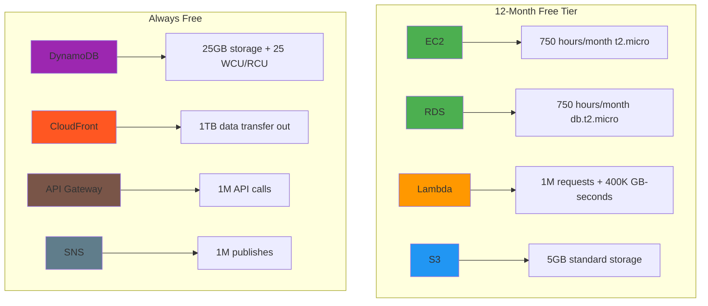
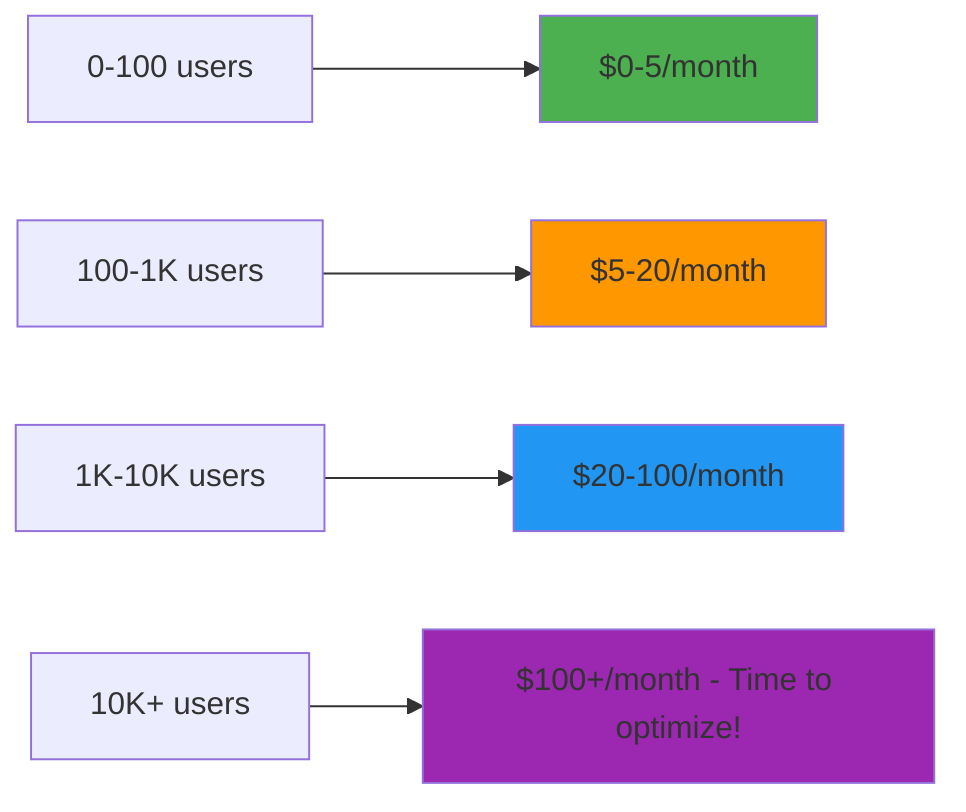

# Cost Control & Free Tier Management

[← Back: Common Pitfalls](09-pitfalls.md) | [Next: Advanced Patterns →](11-advanced.md)

---

## AWS Free Tier: Your MVP Safety Net



**Key Insight:** These limits can support 1000+ users for most MVPs if architected correctly.

---

## Setting Up Cost Monitoring (Do This First!)

### 1. Billing Alerts (5 minutes setup)

```bash
# Create CloudWatch alarm for billing
aws cloudwatch put-metric-alarm \
    --alarm-name "MVP-Billing-Alert-10USD" \
    --alarm-description "Alert when AWS bill exceeds $10" \
    --metric-name EstimatedCharges \
    --namespace AWS/Billing \
    --statistic Maximum \
    --period 86400 \
    --threshold 10 \
    --comparison-operator GreaterThanThreshold \
    --dimensions Name=Currency,Value=USD \
    --evaluation-periods 1 \
    --alarm-actions arn:aws:sns:us-east-1:123456789012:billing-alerts
```

**Pro Tip:** Set multiple alerts at $5, $10, and $20 thresholds.

### 2. AWS Budgets (More Sophisticated)

```json
{
  "BudgetName": "MVP Development Budget",
  "BudgetLimit": {
    "Amount": "15",
    "Unit": "USD"
  },
  "TimeUnit": "MONTHLY",
  "TimePeriod": {
    "Start": "2024-01-01T00:00:00Z",
    "End": "2024-12-31T23:59:59Z"
  },
  "BudgetType": "COST",
  "CostFilters": {
    "Service": [
      "Amazon Elastic Compute Cloud - Compute",
      "Amazon DynamoDB",
      "AWS Lambda"
    ]
  }
}
```

**Set Up Notifications:**

- 80% of budget: "Time to optimize"
- 100% of budget: "Emergency review needed"
- 120% of budget: "Stop all non-essential resources"

### 3. Daily Cost Monitoring Script

```bash
#!/bin/bash
# daily-cost-check.sh - Run this every morning

echo "=== Daily AWS Cost Report ==="
echo "Date: $(date)"
echo "Account: $(aws sts get-caller-identity --query Account --output text)"
echo

# Get current month costs
current_month_start=$(date +%Y-%m-01)
current_month_end=$(date +%Y-%m-%d)

echo "📊 Current Month Spending:"
aws ce get-cost-and-usage \
    --time-period Start=$current_month_start,End=$current_month_end \
    --granularity MONTHLY \
    --metrics "BlendedCost" \
    --query 'ResultsByTime[0].Total.BlendedCost.Amount' \
    --output text | xargs printf "💰 $%.2f USD\n"

echo
echo "📈 Service Breakdown:"
aws ce get-cost-and-usage \
    --time-period Start=$current_month_start,End=$current_month_end \
    --granularity MONTHLY \
    --group-by Type=DIMENSION,Key=SERVICE \
    --metrics "BlendedCost" \
    --query 'ResultsByTime[0].Groups[].[Keys[0],Metrics.BlendedCost.Amount]' \
    --output table

echo
echo "🎯 Free Tier Status Check:"
echo "Run 'aws support describe-trusted-advisor-checks' for detailed free tier usage"
```

**Make it executable:**

```bash
chmod +x daily-cost-check.sh
./daily-cost-check.sh
```

---

## Free Tier Usage Tracking

### Monitor Key Services

**1. Lambda Usage**

```bash
# Check Lambda invocations this month
aws cloudwatch get-metric-statistics \
    --namespace AWS/Lambda \
    --metric-name Invocations \
    --start-time $(date -d "$(date +%Y-%m-01)" +%s) \
    --end-time $(date +%s) \
    --period 2592000 \
    --statistics Sum \
    --query 'Datapoints[0].Sum'

# Free tier limit: 1,000,000 requests/month
```

**2. DynamoDB Usage**

```bash
# Check DynamoDB consumed capacity
aws cloudwatch get-metric-statistics \
    --namespace AWS/DynamoDB \
    --metric-name ConsumedReadCapacityUnits \
    --dimensions Name=TableName,Value=YourTable \
    --start-time $(date -d "$(date +%Y-%m-01)" +%s) \
    --end-time $(date +%s) \
    --period 2592000 \
    --statistics Sum

# Free tier limit: 25 Read/Write Capacity Units
```

**3. S3 Storage**

```bash
# Check S3 storage usage
aws s3api list-buckets --query 'Buckets[].Name' --output text | \
while read bucket; do
    echo "Bucket: $bucket"
    aws cloudwatch get-metric-statistics \
        --namespace AWS/S3 \
        --metric-name BucketSizeBytes \
        --dimensions Name=BucketName,Value=$bucket Name=StorageType,Value=StandardStorage \
        --start-time $(date -d '2 days ago' +%s) \
        --end-time $(date +%s) \
        --period 86400 \
        --statistics Average \
        --query 'Datapoints[0].Average' 2>/dev/null | \
        xargs printf "Size: %.0f bytes\n"
done

# Free tier limit: 5GB
```

### Free Tier Dashboard Script

```python
#!/usr/bin/env python3
# free-tier-dashboard.py

import boto3
import datetime
from decimal import Decimal

def get_free_tier_usage():
    """Generate a free tier usage report"""

    # CloudWatch client
    cloudwatch = boto3.client('cloudwatch')

    # Current month period
    now = datetime.datetime.now()
    start_of_month = now.replace(day=1, hour=0, minute=0, second=0, microsecond=0)

    usage_report = {
        'Lambda': {
            'limit': 1_000_000,
            'current': get_lambda_invocations(cloudwatch, start_of_month, now),
            'unit': 'requests'
        },
        'DynamoDB_Storage': {
            'limit': 25 * 1024**3,  # 25GB in bytes
            'current': get_dynamodb_storage(),
            'unit': 'bytes'
        },
        'S3_Storage': {
            'limit': 5 * 1024**3,  # 5GB in bytes
            'current': get_s3_storage(),
            'unit': 'bytes'
        }
    }

    print("🎯 Free Tier Usage Report")
    print("=" * 50)

    for service, data in usage_report.items():
        percentage = (data['current'] / data['limit']) * 100
        status = "🟢" if percentage < 50 else "🟡" if percentage < 80 else "🔴"

        print(f"{status} {service}: {percentage:.1f}%")
        if data['unit'] == 'bytes':
            print(f"   Used: {data['current']/(1024**3):.2f}GB of {data['limit']/(1024**3):.0f}GB")
        else:
            print(f"   Used: {data['current']:,} of {data['limit']:,} {data['unit']}")
        print()

if __name__ == "__main__":
    get_free_tier_usage()
```

---

## Cost Optimization Strategies

### 1. Architecture for Free Tier

**Smart Service Choices:**

```typescript
// Free-tier optimized architecture
const freetierStack = {
  // Instead of EC2 (limited hours)
  compute: "AWS Lambda", // 1M requests free

  // Instead of RDS (limited hours)
  database: "DynamoDB", // 25GB always free

  // Instead of ELB (always costs money)
  loadBalancer: "CloudFront", // 1TB transfer free

  // Instead of paid monitoring
  monitoring: "CloudWatch", // Basic metrics free

  // Instead of third-party CDN
  cdn: "CloudFront", // Included with S3
};
```

### 2. Resource Right-Sizing

**Start Small Philosophy:**

```typescript
// Good: Start minimal, scale based on data
const mvpResources = {
  lambda: {
    memorySize: 256, // Start here, monitor performance
    timeout: 30, // Most operations finish in <30s
  },
  dynamodb: {
    billingMode: "PAY_PER_REQUEST", // Perfect for unpredictable load
    // Will auto-scale, pay only for what you use
  },
  s3: {
    storageClass: "STANDARD", // Start simple
    lifecyclePolicy: {
      // Move to cheaper storage after 30 days
      transitionToIA: 30,
      transitionToGlacier: 90,
    },
  },
};

// Bad: Over-provision from day 1
const wastefulResources = {
  lambda: {
    memorySize: 3008, // Maximum memory for simple functions
    timeout: 900, // 15 minutes for 5-second tasks
  },
  dynamodb: {
    readCapacity: 1000, // $600+/month
    writeCapacity: 1000, // Way more than needed
  },
};
```

### 3. Development vs Production Environments

**Cost-Conscious Environment Strategy:**

```bash
# Development: Use smallest possible resources
aws lambda create-function \
    --function-name dev-my-function \
    --memory-size 128 \
    --timeout 30

# Staging: Mirror production but smaller scale
aws lambda create-function \
    --function-name staging-my-function \
    --memory-size 256 \
    --timeout 60

# Production: Right-sized based on actual usage data
aws lambda create-function \
    --function-name prod-my-function \
    --memory-size 512 \
    --timeout 120
```

### 4. Automated Cost Optimization

**Lambda Memory Optimization:**

```typescript
// Use AWS Lambda Power Tuning to find optimal memory size
// https://github.com/alexcasalboni/aws-lambda-power-tuning

const optimizationResults = {
  before: {
    memory: 1024,
    duration: 2000, // ms
    cost: 0.0000166667, // per invocation
  },
  after: {
    memory: 512, // Optimal memory size
    duration: 2100, // Slightly longer but much cheaper
    cost: 0.0000083334, // 50% cost reduction!
  },
};
```

**DynamoDB Optimization:**

```typescript
// Monitor and adjust DynamoDB capacity
const optimizeDynamoDB = {
  // Use on-demand for unpredictable workloads
  billingMode: "PAY_PER_REQUEST",

  // Monitor for consistent usage patterns
  switchToProvisioned: {
    when: "Consistent >40% of peak capacity",
    savings: "Up to 60% cost reduction",
  },

  // Use DynamoDB Auto Scaling for provisioned mode
  autoScaling: {
    minCapacity: 5,
    maxCapacity: 100,
    targetUtilization: 70,
  },
};
```

---

## Emergency Cost Controls

### Circuit Breaker Pattern

```python
#!/usr/bin/env python3
# cost-circuit-breaker.py

import boto3
from decimal import Decimal

def emergency_cost_control():
    """Emergency cost control - runs when spending exceeds limits"""

    ce = boto3.client('ce')
    lambda_client = boto3.client('lambda')
    ec2 = boto3.client('ec2')

    # Get current month spending
    current_spending = get_current_spending(ce)

    if current_spending > Decimal('20'):  # Emergency threshold
        print(f"🚨 EMERGENCY: Spending at ${current_spending}")

        # 1. Disable non-critical Lambda functions
        disable_non_critical_lambdas(lambda_client)

        # 2. Stop development EC2 instances
        stop_development_instances(ec2)

        # 3. Send alert to admin
        send_emergency_alert(current_spending)

    elif current_spending > Decimal('15'):  # Warning threshold
        print(f"⚠️  WARNING: Spending at ${current_spending}")

        # Scale down non-critical resources
        scale_down_resources()

def disable_non_critical_lambdas(lambda_client):
    """Disable Lambda functions tagged as non-critical"""
    functions = lambda_client.list_functions()

    for func in functions['Functions']:
        tags = lambda_client.list_tags(Resource=func['FunctionArn'])
        if tags['Tags'].get('Critical') != 'true':
            # Set concurrency to 0 to disable function
            lambda_client.put_provisioned_concurrency_config(
                FunctionName=func['FunctionName'],
                ProvisionedConcurrencyConfig={'ProvisionedConcurrency': 0}
            )
            print(f"Disabled function: {func['FunctionName']}")

def stop_development_instances(ec2):
    """Stop all EC2 instances tagged as development"""
    instances = ec2.describe_instances(
        Filters=[
            {'Name': 'tag:Environment', 'Values': ['dev', 'development']},
            {'Name': 'instance-state-name', 'Values': ['running']}
        ]
    )

    instance_ids = []
    for reservation in instances['Reservations']:
        for instance in reservation['Instances']:
            instance_ids.append(instance['InstanceId'])

    if instance_ids:
        ec2.stop_instances(InstanceIds=instance_ids)
        print(f"Stopped {len(instance_ids)} development instances")

if __name__ == "__main__":
    emergency_cost_control()
```

### Resource Quarantine

```bash
#!/bin/bash
# quarantine-expensive-resources.sh

# Find resources that are costing more than $1/day
aws ce get-cost-and-usage \
    --time-period Start=$(date -d '1 day ago' +%Y-%m-%d),End=$(date +%Y-%m-%d) \
    --granularity DAILY \
    --group-by Type=DIMENSION,Key=SERVICE \
    --metrics "BlendedCost" \
    --query 'ResultsByTime[0].Groups[?to_number(Metrics.BlendedCost.Amount)>`1.0`]'

# Tag expensive resources for review
aws resourcegroupstaggingapi tag-resources \
    --resource-arn-list $(aws ec2 describe-instances \
        --query 'Reservations[].Instances[].InstanceId' \
        --output text) \
    --tags CostReview=needed,ReviewDate=$(date +%Y-%m-%d)
```

---

## Cost Optimization Checklist

### Daily (2 minutes)

- [ ] Check spending dashboard
- [ ] Verify no runaway resources
- [ ] Review CloudWatch alarms

### Weekly (15 minutes)

- [ ] Run cost optimization script
- [ ] Check free tier usage
- [ ] Review and clean up unused resources
- [ ] Analyze Cost Explorer for trends

### Monthly (30 minutes)

- [ ] Deep dive into Cost Explorer
- [ ] Review and adjust budgets
- [ ] Optimize based on usage patterns
- [ ] Plan for next month's growth

### Emergency Procedures

- [ ] **$20+ bill**: Run emergency cost control
- [ ] **Unexpected spike**: Check CloudTrail for unusual activity
- [ ] **Free tier exceeded**: Scale down or optimize immediately
- [ ] **Billing alarm triggered**: Stop all non-essential resources

---

## MVP Cost Targets

### Realistic Monthly Costs by User Count



**Key Insight:** If you're spending >$50/month with <1K users, you're doing something wrong.

### Cost-Per-User Benchmarks

- **Good MVP**: $0.01-0.10 per active user
- **Acceptable**: $0.10-0.50 per active user
- **Needs optimization**: $0.50+ per active user

---

## Key Takeaways

**The 5 Rules of MVP Cost Control:**

1. **Monitor First**: Set up billing alerts before creating resources
2. **Start Small**: Use free tier limits as design constraints
3. **Tag Everything**: Proper resource tagging enables cost tracking
4. **Clean Regularly**: Weekly cleanup prevents cost creep
5. **Optimize Continuously**: Right-size based on actual usage data

**Remember:** The goal isn't zero cost - it's predictable, controlled costs that scale with value delivery.

---

[← Back: Common Pitfalls](09-pitfalls.md) | [Next: Advanced Patterns →](11-advanced.md)
