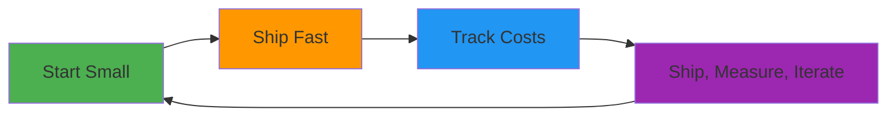

# ₱0 to MVP: AWS Free-Tier Startup Hacks for Students & Pros

_Ship a Real MVP This Weekend, No Surprise Bills_

> **Speaker**: Trisha Pastelero  
> **Event**: AWS User Group Cebu - From Zero to MVP  
> **Focus**: Modern stack, real users, all on AWS Free Tier

---

## 📚 Complete Guide Navigation

### 🚀 **Getting Started**

1. [**The Challenge & Solution**](01-the-challenge.md) - Why MVPs fail and how to fix it
2. [**Key Concepts**](02-key-concepts.md) - MVP, Free Tier, and Architecture basics
3. [**Weekend Case Study**](03-case-study.md) - QR Code Generator walkthrough

### 🛠 **Implementation**

4. [**Demo: Ship This Weekend**](04-demo-steps.md) - Step-by-step weekend timeline
5. [**Architecture Deep Dive**](05-architecture.md) - System design and data flow
6. [**Core AWS Services**](06-aws-services.md) - Amplify, Cognito, DynamoDB, S3, Lambda

### ⚡ **Execution**

7. [**Step-by-Step Guide**](07-implementation.md) - Detailed implementation walkthrough
8. [**Best Practices**](08-best-practices.md) - 5 pillars for MVP success
9. [**Common Pitfalls**](09-pitfalls.md) - Top 5 MVP killers and how to avoid them

### 💰 **Optimization**

10. [**Cost Control**](10-cost-control.md) - Free tier management and monitoring
11. [**Advanced Patterns**](11-advanced.md) - Real-time features and custom resolvers
12. [**Troubleshooting**](12-troubleshooting.md) - Common issues and solutions

### 📖 **Reference**

13. [**Resources & Links**](13-resources.md) - All essential links and references

---

## 🎯 Quick Start Path

**New to AWS?** → [Start Here](01-the-challenge.md)  
**Ready to Code?** → [Demo Steps](04-demo-steps.md)  
**Need Architecture Help?** → [AWS Services](06-aws-services.md)  
**Having Issues?** → [Troubleshooting](12-troubleshooting.md)

---

## 💡 Key Takeaways

1. **Start Small**: Use serverless, managed services
2. **Track Cost From Day One**: Set budgets and alarms
3. **Ship, Measure, Iterate**: Don't perfect before shipping

---

## 📱 This Weekend Checklist

**Saturday Morning (2 hours):**

- [ ] Create AWS account + billing alerts
- [ ] Bootstrap Next.js app
- [ ] Deploy to Amplify
- [ ] Add authentication

**Saturday Afternoon (4 hours):**

- [ ] Set up database
- [ ] Build core feature
- [ ] Add basic UI

**Sunday (3 hours):**

- [ ] Polish and test
- [ ] Deploy to production
- [ ] Share with first users

---

## 🤝 Community

**Get Help:** [AWS Amplify Discord](https://discord.gg/amplify)  
**Share Progress:** Tag #AWSCebu #WeekendMVP  
**Resources:** `[your-short.link/aws-mvp]`

---

_"The best time to ship was last weekend. The second best time is this weekend."_

**Ready to build? Pick your starting point above and let's go! 🚀**
